Assignment 1
================
Eugene Nguyen
9/22/2021

``` r
library(tidyverse)
library(data.table)
library(skimr)
library(lubridate)
library(leaflet)
```

### Load Data

``` r
df1 <- fread('2019.csv')
df2 <- fread('2004.csv')
```

## 1. Given the formulated question from the assignment description, you will now conduct EDA Checklist items 2-4. First, download 2004 and 2019 data for all sites in California from the EPA Air Quality Data website. Read in the data using data.table(). For each of the two datasets, check the dimensions, headers, footers, variable names and variable types. Check for any data issues, particularly in the key variable we are analyzing. Make sure you write up a summary of all of your findings.

### Check the dimensions

``` r
# 2019
dim(df1)
```

    ## [1] 53086    20

``` r
# 2004
dim(df2)
```

    ## [1] 19233    20

### Headers & Footers

``` r
# 2019
head(df1)
```

    ##          Date Source  Site ID POC Daily Mean PM2.5 Concentration    UNITS
    ## 1: 01/01/2019    AQS 60010007   3                            5.7 ug/m3 LC
    ## 2: 01/02/2019    AQS 60010007   3                           11.9 ug/m3 LC
    ## 3: 01/03/2019    AQS 60010007   3                           20.1 ug/m3 LC
    ## 4: 01/04/2019    AQS 60010007   3                           28.8 ug/m3 LC
    ## 5: 01/05/2019    AQS 60010007   3                           11.2 ug/m3 LC
    ## 6: 01/06/2019    AQS 60010007   3                            2.7 ug/m3 LC
    ##    DAILY_AQI_VALUE Site Name DAILY_OBS_COUNT PERCENT_COMPLETE
    ## 1:              24 Livermore               1              100
    ## 2:              50 Livermore               1              100
    ## 3:              68 Livermore               1              100
    ## 4:              86 Livermore               1              100
    ## 5:              47 Livermore               1              100
    ## 6:              11 Livermore               1              100
    ##    AQS_PARAMETER_CODE       AQS_PARAMETER_DESC CBSA_CODE
    ## 1:              88101 PM2.5 - Local Conditions     41860
    ## 2:              88101 PM2.5 - Local Conditions     41860
    ## 3:              88101 PM2.5 - Local Conditions     41860
    ## 4:              88101 PM2.5 - Local Conditions     41860
    ## 5:              88101 PM2.5 - Local Conditions     41860
    ## 6:              88101 PM2.5 - Local Conditions     41860
    ##                            CBSA_NAME STATE_CODE      STATE COUNTY_CODE  COUNTY
    ## 1: San Francisco-Oakland-Hayward, CA          6 California           1 Alameda
    ## 2: San Francisco-Oakland-Hayward, CA          6 California           1 Alameda
    ## 3: San Francisco-Oakland-Hayward, CA          6 California           1 Alameda
    ## 4: San Francisco-Oakland-Hayward, CA          6 California           1 Alameda
    ## 5: San Francisco-Oakland-Hayward, CA          6 California           1 Alameda
    ## 6: San Francisco-Oakland-Hayward, CA          6 California           1 Alameda
    ##    SITE_LATITUDE SITE_LONGITUDE
    ## 1:      37.68753      -121.7842
    ## 2:      37.68753      -121.7842
    ## 3:      37.68753      -121.7842
    ## 4:      37.68753      -121.7842
    ## 5:      37.68753      -121.7842
    ## 6:      37.68753      -121.7842

``` r
tail(df1)
```

    ##          Date Source  Site ID POC Daily Mean PM2.5 Concentration    UNITS
    ## 1: 11/11/2019    AQS 61131003   1                           13.5 ug/m3 LC
    ## 2: 11/17/2019    AQS 61131003   1                           18.1 ug/m3 LC
    ## 3: 11/29/2019    AQS 61131003   1                           12.5 ug/m3 LC
    ## 4: 12/17/2019    AQS 61131003   1                           23.8 ug/m3 LC
    ## 5: 12/23/2019    AQS 61131003   1                            1.0 ug/m3 LC
    ## 6: 12/29/2019    AQS 61131003   1                            9.1 ug/m3 LC
    ##    DAILY_AQI_VALUE            Site Name DAILY_OBS_COUNT PERCENT_COMPLETE
    ## 1:              54 Woodland-Gibson Road               1              100
    ## 2:              64 Woodland-Gibson Road               1              100
    ## 3:              52 Woodland-Gibson Road               1              100
    ## 4:              76 Woodland-Gibson Road               1              100
    ## 5:               4 Woodland-Gibson Road               1              100
    ## 6:              38 Woodland-Gibson Road               1              100
    ##    AQS_PARAMETER_CODE       AQS_PARAMETER_DESC CBSA_CODE
    ## 1:              88101 PM2.5 - Local Conditions     40900
    ## 2:              88101 PM2.5 - Local Conditions     40900
    ## 3:              88101 PM2.5 - Local Conditions     40900
    ## 4:              88101 PM2.5 - Local Conditions     40900
    ## 5:              88101 PM2.5 - Local Conditions     40900
    ## 6:              88101 PM2.5 - Local Conditions     40900
    ##                                  CBSA_NAME STATE_CODE      STATE COUNTY_CODE
    ## 1: Sacramento--Roseville--Arden-Arcade, CA          6 California         113
    ## 2: Sacramento--Roseville--Arden-Arcade, CA          6 California         113
    ## 3: Sacramento--Roseville--Arden-Arcade, CA          6 California         113
    ## 4: Sacramento--Roseville--Arden-Arcade, CA          6 California         113
    ## 5: Sacramento--Roseville--Arden-Arcade, CA          6 California         113
    ## 6: Sacramento--Roseville--Arden-Arcade, CA          6 California         113
    ##    COUNTY SITE_LATITUDE SITE_LONGITUDE
    ## 1:   Yolo      38.66121      -121.7327
    ## 2:   Yolo      38.66121      -121.7327
    ## 3:   Yolo      38.66121      -121.7327
    ## 4:   Yolo      38.66121      -121.7327
    ## 5:   Yolo      38.66121      -121.7327
    ## 6:   Yolo      38.66121      -121.7327

``` r
# 2004
head(df2)
```

    ##          Date Source  Site ID POC Daily Mean PM2.5 Concentration    UNITS
    ## 1: 01/01/2004    AQS 60010007   1                           11.0 ug/m3 LC
    ## 2: 01/02/2004    AQS 60010007   1                           12.2 ug/m3 LC
    ## 3: 01/03/2004    AQS 60010007   1                           16.5 ug/m3 LC
    ## 4: 01/04/2004    AQS 60010007   1                           19.5 ug/m3 LC
    ## 5: 01/05/2004    AQS 60010007   1                           11.5 ug/m3 LC
    ## 6: 01/06/2004    AQS 60010007   1                           32.5 ug/m3 LC
    ##    DAILY_AQI_VALUE Site Name DAILY_OBS_COUNT PERCENT_COMPLETE
    ## 1:              46 Livermore               1              100
    ## 2:              51 Livermore               1              100
    ## 3:              60 Livermore               1              100
    ## 4:              67 Livermore               1              100
    ## 5:              48 Livermore               1              100
    ## 6:              94 Livermore               1              100
    ##    AQS_PARAMETER_CODE                     AQS_PARAMETER_DESC CBSA_CODE
    ## 1:              88502 Acceptable PM2.5 AQI & Speciation Mass     41860
    ## 2:              88502 Acceptable PM2.5 AQI & Speciation Mass     41860
    ## 3:              88502 Acceptable PM2.5 AQI & Speciation Mass     41860
    ## 4:              88502 Acceptable PM2.5 AQI & Speciation Mass     41860
    ## 5:              88502 Acceptable PM2.5 AQI & Speciation Mass     41860
    ## 6:              88502 Acceptable PM2.5 AQI & Speciation Mass     41860
    ##                            CBSA_NAME STATE_CODE      STATE COUNTY_CODE  COUNTY
    ## 1: San Francisco-Oakland-Hayward, CA          6 California           1 Alameda
    ## 2: San Francisco-Oakland-Hayward, CA          6 California           1 Alameda
    ## 3: San Francisco-Oakland-Hayward, CA          6 California           1 Alameda
    ## 4: San Francisco-Oakland-Hayward, CA          6 California           1 Alameda
    ## 5: San Francisco-Oakland-Hayward, CA          6 California           1 Alameda
    ## 6: San Francisco-Oakland-Hayward, CA          6 California           1 Alameda
    ##    SITE_LATITUDE SITE_LONGITUDE
    ## 1:      37.68753      -121.7842
    ## 2:      37.68753      -121.7842
    ## 3:      37.68753      -121.7842
    ## 4:      37.68753      -121.7842
    ## 5:      37.68753      -121.7842
    ## 6:      37.68753      -121.7842

``` r
tail(df2)
```

    ##          Date Source  Site ID POC Daily Mean PM2.5 Concentration    UNITS
    ## 1: 12/14/2004    AQS 61131003   1                             11 ug/m3 LC
    ## 2: 12/17/2004    AQS 61131003   1                             16 ug/m3 LC
    ## 3: 12/20/2004    AQS 61131003   1                             17 ug/m3 LC
    ## 4: 12/23/2004    AQS 61131003   1                              9 ug/m3 LC
    ## 5: 12/26/2004    AQS 61131003   1                             24 ug/m3 LC
    ## 6: 12/29/2004    AQS 61131003   1                              9 ug/m3 LC
    ##    DAILY_AQI_VALUE            Site Name DAILY_OBS_COUNT PERCENT_COMPLETE
    ## 1:              46 Woodland-Gibson Road               1              100
    ## 2:              59 Woodland-Gibson Road               1              100
    ## 3:              61 Woodland-Gibson Road               1              100
    ## 4:              38 Woodland-Gibson Road               1              100
    ## 5:              76 Woodland-Gibson Road               1              100
    ## 6:              38 Woodland-Gibson Road               1              100
    ##    AQS_PARAMETER_CODE       AQS_PARAMETER_DESC CBSA_CODE
    ## 1:              88101 PM2.5 - Local Conditions     40900
    ## 2:              88101 PM2.5 - Local Conditions     40900
    ## 3:              88101 PM2.5 - Local Conditions     40900
    ## 4:              88101 PM2.5 - Local Conditions     40900
    ## 5:              88101 PM2.5 - Local Conditions     40900
    ## 6:              88101 PM2.5 - Local Conditions     40900
    ##                                  CBSA_NAME STATE_CODE      STATE COUNTY_CODE
    ## 1: Sacramento--Roseville--Arden-Arcade, CA          6 California         113
    ## 2: Sacramento--Roseville--Arden-Arcade, CA          6 California         113
    ## 3: Sacramento--Roseville--Arden-Arcade, CA          6 California         113
    ## 4: Sacramento--Roseville--Arden-Arcade, CA          6 California         113
    ## 5: Sacramento--Roseville--Arden-Arcade, CA          6 California         113
    ## 6: Sacramento--Roseville--Arden-Arcade, CA          6 California         113
    ##    COUNTY SITE_LATITUDE SITE_LONGITUDE
    ## 1:   Yolo      38.66121      -121.7327
    ## 2:   Yolo      38.66121      -121.7327
    ## 3:   Yolo      38.66121      -121.7327
    ## 4:   Yolo      38.66121      -121.7327
    ## 5:   Yolo      38.66121      -121.7327
    ## 6:   Yolo      38.66121      -121.7327

### Variable Names

``` r
# 2019
names(df1)
```

    ##  [1] "Date"                           "Source"                        
    ##  [3] "Site ID"                        "POC"                           
    ##  [5] "Daily Mean PM2.5 Concentration" "UNITS"                         
    ##  [7] "DAILY_AQI_VALUE"                "Site Name"                     
    ##  [9] "DAILY_OBS_COUNT"                "PERCENT_COMPLETE"              
    ## [11] "AQS_PARAMETER_CODE"             "AQS_PARAMETER_DESC"            
    ## [13] "CBSA_CODE"                      "CBSA_NAME"                     
    ## [15] "STATE_CODE"                     "STATE"                         
    ## [17] "COUNTY_CODE"                    "COUNTY"                        
    ## [19] "SITE_LATITUDE"                  "SITE_LONGITUDE"

``` r
# 2004
names(df2)
```

    ##  [1] "Date"                           "Source"                        
    ##  [3] "Site ID"                        "POC"                           
    ##  [5] "Daily Mean PM2.5 Concentration" "UNITS"                         
    ##  [7] "DAILY_AQI_VALUE"                "Site Name"                     
    ##  [9] "DAILY_OBS_COUNT"                "PERCENT_COMPLETE"              
    ## [11] "AQS_PARAMETER_CODE"             "AQS_PARAMETER_DESC"            
    ## [13] "CBSA_CODE"                      "CBSA_NAME"                     
    ## [15] "STATE_CODE"                     "STATE"                         
    ## [17] "COUNTY_CODE"                    "COUNTY"                        
    ## [19] "SITE_LATITUDE"                  "SITE_LONGITUDE"

### Types

``` r
# 2019
str(df1)
```

    ## Classes 'data.table' and 'data.frame':   53086 obs. of  20 variables:
    ##  $ Date                          : chr  "01/01/2019" "01/02/2019" "01/03/2019" "01/04/2019" ...
    ##  $ Source                        : chr  "AQS" "AQS" "AQS" "AQS" ...
    ##  $ Site ID                       : int  60010007 60010007 60010007 60010007 60010007 60010007 60010007 60010007 60010007 60010007 ...
    ##  $ POC                           : int  3 3 3 3 3 3 3 3 3 3 ...
    ##  $ Daily Mean PM2.5 Concentration: num  5.7 11.9 20.1 28.8 11.2 2.7 2.8 7 3.1 7.1 ...
    ##  $ UNITS                         : chr  "ug/m3 LC" "ug/m3 LC" "ug/m3 LC" "ug/m3 LC" ...
    ##  $ DAILY_AQI_VALUE               : int  24 50 68 86 47 11 12 29 13 30 ...
    ##  $ Site Name                     : chr  "Livermore" "Livermore" "Livermore" "Livermore" ...
    ##  $ DAILY_OBS_COUNT               : int  1 1 1 1 1 1 1 1 1 1 ...
    ##  $ PERCENT_COMPLETE              : num  100 100 100 100 100 100 100 100 100 100 ...
    ##  $ AQS_PARAMETER_CODE            : int  88101 88101 88101 88101 88101 88101 88101 88101 88101 88101 ...
    ##  $ AQS_PARAMETER_DESC            : chr  "PM2.5 - Local Conditions" "PM2.5 - Local Conditions" "PM2.5 - Local Conditions" "PM2.5 - Local Conditions" ...
    ##  $ CBSA_CODE                     : int  41860 41860 41860 41860 41860 41860 41860 41860 41860 41860 ...
    ##  $ CBSA_NAME                     : chr  "San Francisco-Oakland-Hayward, CA" "San Francisco-Oakland-Hayward, CA" "San Francisco-Oakland-Hayward, CA" "San Francisco-Oakland-Hayward, CA" ...
    ##  $ STATE_CODE                    : int  6 6 6 6 6 6 6 6 6 6 ...
    ##  $ STATE                         : chr  "California" "California" "California" "California" ...
    ##  $ COUNTY_CODE                   : int  1 1 1 1 1 1 1 1 1 1 ...
    ##  $ COUNTY                        : chr  "Alameda" "Alameda" "Alameda" "Alameda" ...
    ##  $ SITE_LATITUDE                 : num  37.7 37.7 37.7 37.7 37.7 ...
    ##  $ SITE_LONGITUDE                : num  -122 -122 -122 -122 -122 ...
    ##  - attr(*, ".internal.selfref")=<externalptr>

``` r
# 2004
str(df2)
```

    ## Classes 'data.table' and 'data.frame':   19233 obs. of  20 variables:
    ##  $ Date                          : chr  "01/01/2004" "01/02/2004" "01/03/2004" "01/04/2004" ...
    ##  $ Source                        : chr  "AQS" "AQS" "AQS" "AQS" ...
    ##  $ Site ID                       : int  60010007 60010007 60010007 60010007 60010007 60010007 60010007 60010007 60010007 60010007 ...
    ##  $ POC                           : int  1 1 1 1 1 1 1 1 1 1 ...
    ##  $ Daily Mean PM2.5 Concentration: num  11 12.2 16.5 19.5 11.5 32.5 15.5 29.9 21 16.9 ...
    ##  $ UNITS                         : chr  "ug/m3 LC" "ug/m3 LC" "ug/m3 LC" "ug/m3 LC" ...
    ##  $ DAILY_AQI_VALUE               : int  46 51 60 67 48 94 58 88 70 61 ...
    ##  $ Site Name                     : chr  "Livermore" "Livermore" "Livermore" "Livermore" ...
    ##  $ DAILY_OBS_COUNT               : int  1 1 1 1 1 1 1 1 1 1 ...
    ##  $ PERCENT_COMPLETE              : num  100 100 100 100 100 100 100 100 100 100 ...
    ##  $ AQS_PARAMETER_CODE            : int  88502 88502 88502 88502 88502 88502 88502 88502 88502 88502 ...
    ##  $ AQS_PARAMETER_DESC            : chr  "Acceptable PM2.5 AQI & Speciation Mass" "Acceptable PM2.5 AQI & Speciation Mass" "Acceptable PM2.5 AQI & Speciation Mass" "Acceptable PM2.5 AQI & Speciation Mass" ...
    ##  $ CBSA_CODE                     : int  41860 41860 41860 41860 41860 41860 41860 41860 41860 41860 ...
    ##  $ CBSA_NAME                     : chr  "San Francisco-Oakland-Hayward, CA" "San Francisco-Oakland-Hayward, CA" "San Francisco-Oakland-Hayward, CA" "San Francisco-Oakland-Hayward, CA" ...
    ##  $ STATE_CODE                    : int  6 6 6 6 6 6 6 6 6 6 ...
    ##  $ STATE                         : chr  "California" "California" "California" "California" ...
    ##  $ COUNTY_CODE                   : int  1 1 1 1 1 1 1 1 1 1 ...
    ##  $ COUNTY                        : chr  "Alameda" "Alameda" "Alameda" "Alameda" ...
    ##  $ SITE_LATITUDE                 : num  37.7 37.7 37.7 37.7 37.7 ...
    ##  $ SITE_LONGITUDE                : num  -122 -122 -122 -122 -122 ...
    ##  - attr(*, ".internal.selfref")=<externalptr>

### Check for data issues

### 2019 Data

``` r
skim(df1)
```

|                                                  |       |
|:-------------------------------------------------|:------|
| Name                                             | df1   |
| Number of rows                                   | 53086 |
| Number of columns                                | 20    |
| Key                                              | NULL  |
| \_\_\_\_\_\_\_\_\_\_\_\_\_\_\_\_\_\_\_\_\_\_\_   |       |
| Column type frequency:                           |       |
| character                                        | 8     |
| numeric                                          | 12    |
| \_\_\_\_\_\_\_\_\_\_\_\_\_\_\_\_\_\_\_\_\_\_\_\_ |       |
| Group variables                                  | None  |

Data summary

**Variable type: character**

| skim\_variable       | n\_missing | complete\_rate | min | max | empty | n\_unique | whitespace |
|:---------------------|-----------:|---------------:|----:|----:|------:|----------:|-----------:|
| Date                 |          0 |              1 |  10 |  10 |     0 |       365 |          0 |
| Source               |          0 |              1 |   3 |   3 |     0 |         1 |          0 |
| UNITS                |          0 |              1 |   8 |   8 |     0 |         1 |          0 |
| Site Name            |          0 |              1 |   0 |  49 |   102 |       159 |          0 |
| AQS\_PARAMETER\_DESC |          0 |              1 |  24 |  38 |     0 |         2 |          0 |
| CBSA\_NAME           |          0 |              1 |   0 |  45 |  4181 |        34 |          0 |
| STATE                |          0 |              1 |  10 |  10 |     0 |         1 |          0 |
| COUNTY               |          0 |              1 |   4 |  15 |     0 |        51 |          0 |

**Variable type: numeric**

| skim\_variable                 | n\_missing | complete\_rate |        mean |        sd |          p0 |         p25 |         p50 |         p75 |        p100 | hist  |
|:-------------------------------|-----------:|---------------:|------------:|----------:|------------:|------------:|------------:|------------:|------------:|:------|
| Site ID                        |          0 |           1.00 | 60565290.91 | 300345.25 | 60010007.00 | 60310004.00 | 60612003.00 | 60771002.00 | 61131003.00 | ▆▇▇▇▅ |
| POC                            |          0 |           1.00 |        2.56 |      1.73 |        1.00 |        1.00 |        3.00 |        3.00 |       21.00 | ▇▁▁▁▁ |
| Daily Mean PM2.5 Concentration |          0 |           1.00 |        7.73 |      5.81 |       -2.20 |        4.00 |        6.50 |        9.90 |      120.90 | ▇▁▁▁▁ |
| DAILY\_AQI\_VALUE              |          0 |           1.00 |       30.56 |     18.78 |        0.00 |       17.00 |       27.00 |       41.00 |      185.00 | ▇▃▁▁▁ |
| DAILY\_OBS\_COUNT              |          0 |           1.00 |        1.00 |      0.00 |        1.00 |        1.00 |        1.00 |        1.00 |        1.00 | ▁▁▇▁▁ |
| PERCENT\_COMPLETE              |          0 |           1.00 |      100.00 |      0.00 |      100.00 |      100.00 |      100.00 |      100.00 |      100.00 | ▁▁▇▁▁ |
| AQS\_PARAMETER\_CODE           |          0 |           1.00 |    88213.44 |    180.13 |    88101.00 |    88101.00 |    88101.00 |    88502.00 |    88502.00 | ▇▁▁▁▃ |
| CBSA\_CODE                     |       4181 |           0.92 |    35840.67 |   9408.94 |    12540.00 |    31080.00 |    40140.00 |    41860.00 |    49700.00 | ▂▂▂▇▂ |
| STATE\_CODE                    |          0 |           1.00 |        6.00 |      0.00 |        6.00 |        6.00 |        6.00 |        6.00 |        6.00 | ▁▁▇▁▁ |
| COUNTY\_CODE                   |          0 |           1.00 |       56.39 |     30.03 |        1.00 |       31.00 |       61.00 |       77.00 |      113.00 | ▆▇▇▇▅ |
| SITE\_LATITUDE                 |          0 |           1.00 |       36.35 |      2.22 |       32.58 |       34.14 |       36.63 |       37.97 |       41.76 | ▇▃▇▅▁ |
| SITE\_LONGITUDE                |          0 |           1.00 |     -119.82 |      2.00 |     -124.20 |     -121.59 |     -119.83 |     -118.15 |     -115.48 | ▁▇▅▆▂ |

> There are 4,181 missing in the CBSA\_CODE column.Let’s further
> investigate this variable and see what’s going on.

### Inspect missing CBSA\_CODE

``` r
df1 %>%
  filter(is.na(CBSA_CODE))
```

    ##             Date Source  Site ID POC Daily Mean PM2.5 Concentration    UNITS
    ##    1: 01/01/2019    AQS 60090001   3                           17.9 ug/m3 LC
    ##    2: 01/02/2019    AQS 60090001   3                           24.8 ug/m3 LC
    ##    3: 01/12/2019    AQS 60090001   3                            6.7 ug/m3 LC
    ##    4: 01/13/2019    AQS 60090001   3                            7.5 ug/m3 LC
    ##    5: 01/14/2019    AQS 60090001   3                           10.0 ug/m3 LC
    ##   ---                                                                       
    ## 4177: 12/17/2019    AQS 61059000   1                            2.3 ug/m3 LC
    ## 4178: 12/20/2019    AQS 61059000   1                            1.0 ug/m3 LC
    ## 4179: 12/23/2019    AQS 61059000   1                            0.9 ug/m3 LC
    ## 4180: 12/26/2019    AQS 61059000   1                            0.6 ug/m3 LC
    ## 4181: 12/29/2019    AQS 61059000   1                            4.8 ug/m3 LC
    ##       DAILY_AQI_VALUE                    Site Name DAILY_OBS_COUNT
    ##    1:              63 San Andreas-Gold Strike Road               1
    ##    2:              78 San Andreas-Gold Strike Road               1
    ##    3:              28 San Andreas-Gold Strike Road               1
    ##    4:              31 San Andreas-Gold Strike Road               1
    ##    5:              42 San Andreas-Gold Strike Road               1
    ##   ---                                                             
    ## 4177:              10                      Trinity               1
    ## 4178:               4                      Trinity               1
    ## 4179:               4                      Trinity               1
    ## 4180:               3                      Trinity               1
    ## 4181:              20                      Trinity               1
    ##       PERCENT_COMPLETE AQS_PARAMETER_CODE
    ##    1:              100              88101
    ##    2:              100              88101
    ##    3:              100              88101
    ##    4:              100              88101
    ##    5:              100              88101
    ##   ---                                    
    ## 4177:              100              88502
    ## 4178:              100              88502
    ## 4179:              100              88502
    ## 4180:              100              88502
    ## 4181:              100              88502
    ##                           AQS_PARAMETER_DESC CBSA_CODE CBSA_NAME STATE_CODE
    ##    1:               PM2.5 - Local Conditions        NA                    6
    ##    2:               PM2.5 - Local Conditions        NA                    6
    ##    3:               PM2.5 - Local Conditions        NA                    6
    ##    4:               PM2.5 - Local Conditions        NA                    6
    ##    5:               PM2.5 - Local Conditions        NA                    6
    ##   ---                                                                      
    ## 4177: Acceptable PM2.5 AQI & Speciation Mass        NA                    6
    ## 4178: Acceptable PM2.5 AQI & Speciation Mass        NA                    6
    ## 4179: Acceptable PM2.5 AQI & Speciation Mass        NA                    6
    ## 4180: Acceptable PM2.5 AQI & Speciation Mass        NA                    6
    ## 4181: Acceptable PM2.5 AQI & Speciation Mass        NA                    6
    ##            STATE COUNTY_CODE    COUNTY SITE_LATITUDE SITE_LONGITUDE
    ##    1: California           9 Calaveras      38.20185      -120.6803
    ##    2: California           9 Calaveras      38.20185      -120.6803
    ##    3: California           9 Calaveras      38.20185      -120.6803
    ##    4: California           9 Calaveras      38.20185      -120.6803
    ##    5: California           9 Calaveras      38.20185      -120.6803
    ##   ---                                                              
    ## 4177: California         105   Trinity      40.78625      -122.8057
    ## 4178: California         105   Trinity      40.78625      -122.8057
    ## 4179: California         105   Trinity      40.78625      -122.8057
    ## 4180: California         105   Trinity      40.78625      -122.8057
    ## 4181: California         105   Trinity      40.78625      -122.8057

> It appears as if there is still valuable data, so we will keep the
> rows.

### 2004 Data

``` r
skim(df2)
```

|                                                  |       |
|:-------------------------------------------------|:------|
| Name                                             | df2   |
| Number of rows                                   | 19233 |
| Number of columns                                | 20    |
| Key                                              | NULL  |
| \_\_\_\_\_\_\_\_\_\_\_\_\_\_\_\_\_\_\_\_\_\_\_   |       |
| Column type frequency:                           |       |
| character                                        | 8     |
| numeric                                          | 12    |
| \_\_\_\_\_\_\_\_\_\_\_\_\_\_\_\_\_\_\_\_\_\_\_\_ |       |
| Group variables                                  | None  |

Data summary

**Variable type: character**

| skim\_variable       | n\_missing | complete\_rate | min | max | empty | n\_unique | whitespace |
|:---------------------|-----------:|---------------:|----:|----:|------:|----------:|-----------:|
| Date                 |          0 |              1 |  10 |  10 |     0 |       366 |          0 |
| Source               |          0 |              1 |   3 |   3 |     0 |         1 |          0 |
| UNITS                |          0 |              1 |   8 |   8 |     0 |         1 |          0 |
| Site Name            |          0 |              1 |   0 |  49 |   229 |       105 |          0 |
| AQS\_PARAMETER\_DESC |          0 |              1 |  24 |  38 |     0 |         2 |          0 |
| CBSA\_NAME           |          0 |              1 |   0 |  45 |  1253 |        31 |          0 |
| STATE                |          0 |              1 |  10 |  10 |     0 |         1 |          0 |
| COUNTY               |          0 |              1 |   4 |  15 |     0 |        47 |          0 |

**Variable type: numeric**

| skim\_variable                 | n\_missing | complete\_rate |        mean |        sd |          p0 |         p25 |         p50 |         p75 |        p100 | hist  |
|:-------------------------------|-----------:|---------------:|------------:|----------:|------------:|------------:|------------:|------------:|------------:|:------|
| Site ID                        |          0 |           1.00 | 60588026.13 | 296496.39 | 60010007.00 | 60370002.00 | 60658001.00 | 60750006.00 | 61131003.00 | ▅▇▇▇▅ |
| POC                            |          0 |           1.00 |        1.82 |      1.81 |        1.00 |        1.00 |        1.00 |        2.00 |       12.00 | ▇▁▁▁▁ |
| Daily Mean PM2.5 Concentration |          0 |           1.00 |       13.12 |     10.92 |       -0.10 |        6.00 |       10.10 |       16.30 |      251.00 | ▇▁▁▁▁ |
| DAILY\_AQI\_VALUE              |          0 |           1.00 |       46.33 |     28.16 |        0.00 |       25.00 |       42.00 |       60.00 |      301.00 | ▇▂▁▁▁ |
| DAILY\_OBS\_COUNT              |          0 |           1.00 |        1.00 |      0.00 |        1.00 |        1.00 |        1.00 |        1.00 |        1.00 | ▁▁▇▁▁ |
| PERCENT\_COMPLETE              |          0 |           1.00 |      100.00 |      0.00 |      100.00 |      100.00 |      100.00 |      100.00 |      100.00 | ▁▁▇▁▁ |
| AQS\_PARAMETER\_CODE           |          0 |           1.00 |    88267.53 |    197.61 |    88101.00 |    88101.00 |    88101.00 |    88502.00 |    88502.00 | ▇▁▁▁▆ |
| CBSA\_CODE                     |       1253 |           0.93 |    35327.51 |  10055.90 |    12540.00 |    31080.00 |    40140.00 |    41860.00 |    49700.00 | ▂▁▂▇▂ |
| STATE\_CODE                    |          0 |           1.00 |        6.00 |      0.00 |        6.00 |        6.00 |        6.00 |        6.00 |        6.00 | ▁▁▇▁▁ |
| COUNTY\_CODE                   |          0 |           1.00 |       58.63 |     29.66 |        1.00 |       37.00 |       65.00 |       75.00 |      113.00 | ▅▇▇▇▅ |
| SITE\_LATITUDE                 |          0 |           1.00 |       36.23 |      2.29 |       32.63 |       34.07 |       36.48 |       38.10 |       41.71 | ▇▂▆▅▁ |
| SITE\_LONGITUDE                |          0 |           1.00 |     -119.65 |      2.01 |     -124.16 |     -121.62 |     -119.29 |     -117.94 |     -115.48 | ▁▇▅▆▃ |

> Same as the 2019 data, there are some missing values in the CBSA\_CODE
> field, but we will keep.

## 2. Combine the two years of data into one data frame. Use the Date variable to create a new column for year, which will serve as an identifier. Change the names of the key variables so that they are easier to refer to in your code.

### Combine dataframes

``` r
# Union
df <- union_all(df1, df2)
```

### Create a new column for year

``` r
# Convert from chr to date
df$Date <- mdy(df$Date)

# Create year variable
df$year <- year (df$Date)
```

### Change the names of key variables

``` r
df <- 
  df %>%
  rename(pm = "Daily Mean PM2.5 Concentration"
         , lat = "SITE_LATITUDE"
         , lon = "SITE_LONGITUDE"
         , site = "Site Name"
         )
```

## 3. Create a basic map in leaflet() that shows the locations of the sites (make sure to use different colors for each year). Summarize the spatial distribution of the monitoring sites.

``` r
# Aggregate data
#df_avg <- df[,.(pm = mean(pm, na.rm=TRUE), lat = mean(lat), lon = mean(lon)),  by=c("year")]

# Generating a color palette
#pm.pal <- colorNumeric(c('darkgreen','goldenrod','brown'), domain=df$pm)
year.pal <- colorFactor(c('firebrick','dodgerblue'), domain=df$year)
```

### Leaflet Graph

``` r
tempmap <- leaflet(df) %>% 
  # The looks of the Map
  addProviderTiles('CartoDB.Positron') %>% 
  # Some circles
  addCircles(
    lat = ~lat, lng=~lon,
                                                  # HERE IS OUR PAL!
    label = ~paste0(round(year,2), ' C'), color = ~ year.pal(year),
    opacity = .5, fillOpacity = .5, radius = 500
    ) %>%
  # And a pretty legend
  addLegend('bottomleft', pal=year.pal, values=df$year,
          title='Temperature, C', opacity=1)

tempmap
```

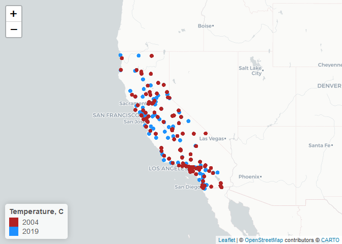<!-- -->
\#\# 4. Check for any missing or implausible values of PM in the
combined dataset. Explore the proportions of each and provide a summary
of any temporal patterns you see in these observations. \#\#\# Skim PM

``` r
skim(df$pm)
```

|                                                  |       |
|:-------------------------------------------------|:------|
| Name                                             | df$pm |
| Number of rows                                   | 72319 |
| Number of columns                                | 1     |
| \_\_\_\_\_\_\_\_\_\_\_\_\_\_\_\_\_\_\_\_\_\_\_   |       |
| Column type frequency:                           |       |
| numeric                                          | 1     |
| \_\_\_\_\_\_\_\_\_\_\_\_\_\_\_\_\_\_\_\_\_\_\_\_ |       |
| Group variables                                  | None  |

Data summary

**Variable type: numeric**

| skim\_variable | n\_missing | complete\_rate | mean |   sd |   p0 | p25 | p50 |  p75 | p100 | hist  |
|:---------------|-----------:|---------------:|-----:|-----:|-----:|----:|----:|-----:|-----:|:------|
| data           |          0 |              1 | 9.17 | 7.89 | -2.2 | 4.4 | 7.2 | 11.3 |  251 | ▇▁▁▁▁ |

### Check for negative values

``` r
df %>%
  filter(pm < 0)
```

    ##            Date Source  Site ID POC   pm    UNITS DAILY_AQI_VALUE
    ##   1: 2019-12-01    AQS 60010011   3 -0.3 ug/m3 LC               0
    ##   2: 2019-12-01    AQS 60010012   3 -0.5 ug/m3 LC               0
    ##   3: 2019-02-03    AQS 60070008   3 -0.3 ug/m3 LC               0
    ##   4: 2019-02-17    AQS 60070008   3 -0.1 ug/m3 LC               0
    ##   5: 2019-02-18    AQS 60072002   3 -0.2 ug/m3 LC               0
    ##  ---                                                             
    ## 279: 2019-01-08    AQS 61110009   3 -0.5 ug/m3 LC               0
    ## 280: 2019-12-26    AQS 61110009   3 -0.5 ug/m3 LC               0
    ## 281: 2019-01-26    AQS 61112002   3 -0.4 ug/m3 LC               0
    ## 282: 2019-12-26    AQS 61113001   3 -0.4 ug/m3 LC               0
    ## 283: 2004-12-08    AQS 60199000   1 -0.1 ug/m3 LC               0
    ##                            site DAILY_OBS_COUNT PERCENT_COMPLETE
    ##   1:               Oakland West               1              100
    ##   2:              Laney College               1              100
    ##   3:          Chico-East Avenue               1              100
    ##   4:          Chico-East Avenue               1              100
    ##   5:         Paradise - Theater               1              100
    ##  ---                                                            
    ## 279:             Piru - Pacific               1              100
    ## 280:             Piru - Pacific               1              100
    ## 281: Simi Valley-Cochran Street               1              100
    ## 282:  El Rio-Rio Mesa School #2               1              100
    ## 283:          Kaiser Wilderness               1              100
    ##      AQS_PARAMETER_CODE                     AQS_PARAMETER_DESC CBSA_CODE
    ##   1:              88101               PM2.5 - Local Conditions     41860
    ##   2:              88101               PM2.5 - Local Conditions     41860
    ##   3:              88502 Acceptable PM2.5 AQI & Speciation Mass     17020
    ##   4:              88502 Acceptable PM2.5 AQI & Speciation Mass     17020
    ##   5:              88502 Acceptable PM2.5 AQI & Speciation Mass     17020
    ##  ---                                                                    
    ## 279:              88101               PM2.5 - Local Conditions     37100
    ## 280:              88101               PM2.5 - Local Conditions     37100
    ## 281:              88101               PM2.5 - Local Conditions     37100
    ## 282:              88101               PM2.5 - Local Conditions     37100
    ## 283:              88502 Acceptable PM2.5 AQI & Speciation Mass     23420
    ##                              CBSA_NAME STATE_CODE      STATE COUNTY_CODE
    ##   1: San Francisco-Oakland-Hayward, CA          6 California           1
    ##   2: San Francisco-Oakland-Hayward, CA          6 California           1
    ##   3:                         Chico, CA          6 California           7
    ##   4:                         Chico, CA          6 California           7
    ##   5:                         Chico, CA          6 California           7
    ##  ---                                                                    
    ## 279:  Oxnard-Thousand Oaks-Ventura, CA          6 California         111
    ## 280:  Oxnard-Thousand Oaks-Ventura, CA          6 California         111
    ## 281:  Oxnard-Thousand Oaks-Ventura, CA          6 California         111
    ## 282:  Oxnard-Thousand Oaks-Ventura, CA          6 California         111
    ## 283:                        Fresno, CA          6 California          19
    ##       COUNTY      lat       lon year
    ##   1: Alameda 37.81478 -122.2823 2019
    ##   2: Alameda 37.79362 -122.2634 2019
    ##   3:   Butte 39.76168 -121.8405 2019
    ##   4:   Butte 39.76168 -121.8405 2019
    ##   5:   Butte 39.77919 -121.5914 2019
    ##  ---                                
    ## 279: Ventura 34.40428 -118.8100 2019
    ## 280: Ventura 34.40428 -118.8100 2019
    ## 281: Ventura 34.27632 -118.6837 2019
    ## 282: Ventura 34.25239 -119.1432 2019
    ## 283:  Fresno 37.22064 -119.1556 2004

### Plot PM

``` r
ggplot(df, aes(x = pm)) +
  geom_histogram()
```

    ## `stat_bin()` using `bins = 30`. Pick better value with `binwidth`.

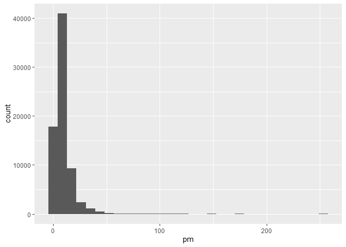<!-- -->

``` r
ggplot(df, aes(y = pm)) +
  geom_boxplot()
```

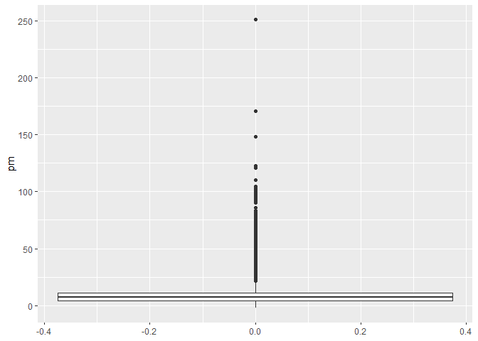<!-- -->

### Categorize into groups

``` r
# Create category for PM
df <- 
  df %>%
  mutate(pm_cat = case_when(
    pm < 50 ~ "Less than 50"
    , pm >= 50 & pm < 100 ~ "50 - 100"
    , pm >= 100 & pm < 150 ~ "100 - 150"
    , pm >= 150 & pm < 200 ~ "150 - 200"
    , pm >= 200 ~ "200+")
  )

# Convert to Factor
df$pm_cat <- factor(df$pm_cat,
                    levels = c("Less than 50"
                               , "50 - 100"
                               , "100 - 150"
                               , "150 - 200"
                               , "200+"))
```

### Contingency Tables

``` r
table(df$COUNTY, df$pm_cat)
```

    ##                  
    ##                   Less than 50 50 - 100 100 - 150 150 - 200 200+
    ##   Alameda                 2595        0         0         0    0
    ##   Butte                   1691        7         0         0    0
    ##   Calaveras                399        0         0         0    0
    ##   Colusa                   929        0         0         0    0
    ##   Contra Costa            1068        2         0         0    0
    ##   Del Norte                426        0         0         0    0
    ##   El Dorado                305        0         0         0    0
    ##   Fresno                  3465       17         0         0    0
    ##   Glenn                    356        0         0         0    0
    ##   Humboldt                 165        0         0         0    0
    ##   Imperial                1369        3         0         0    0
    ##   Inyo                    1144        5         0         0    0
    ##   Kern                    3333       55         0         0    0
    ##   Kings                    886        3         0         0    0
    ##   Lake                     120        0         0         0    0
    ##   Los Angeles             7081       52         1         0    0
    ##   Madera                   357        0         0         0    0
    ##   Marin                    577        0         0         0    0
    ##   Mariposa                 836       13         5         1    1
    ##   Mendocino                774        0         0         0    0
    ##   Merced                   568        1         0         0    0
    ##   Mono                    1071        0         0         0    0
    ##   Monterey                1185        1         0         0    0
    ##   Napa                     355        0         0         0    0
    ##   Nevada                   758        0         0         0    0
    ##   Orange                  1391        7         0         0    0
    ##   Placer                  1930        1         0         0    0
    ##   Plumas                   787        1         0         0    0
    ##   Riverside               5510       45         1         0    0
    ##   Sacramento              3582        5         0         0    0
    ##   San Benito               588        0         0         0    0
    ##   San Bernardino          3474       21         1         0    0
    ##   San Diego               3585        1         0         0    0
    ##   San Francisco            918        1         0         0    0
    ##   San Joaquin             1428        1         0         0    0
    ##   San Luis Obispo         1595        0         0         0    0
    ##   San Mateo                698        0         0         0    0
    ##   Santa Barbara           1743        0         0         0    0
    ##   Santa Clara             1859        1         0         0    0
    ##   Santa Cruz               753        0         0         0    0
    ##   Shasta                   326        1         0         0    0
    ##   Siskiyou                 571        4         0         0    0
    ##   Solano                  1077        0         0         0    0
    ##   Sonoma                   435        0         0         0    0
    ##   Stanislaus               979        2         0         0    0
    ##   Sutter                  1017        0         0         0    0
    ##   Tehama                   353        0         0         0    0
    ##   Trinity                  460        0         0         0    0
    ##   Tulare                  1592       10         0         0    0
    ##   Ventura                 2705        0         0         0    0
    ##   Yolo                     880        0         0         0    0

> It appears most values fall in the less than 50 group. Some values
> fall between 50 - 100, and there are rare values 100 and up. Fur
> future analyses, we might want to constrain the dataset to only
> include values less than 50. Further research on particulate matter
> air pollution should be investigated to see if values above 100 are
> possible.

## 5. Explore the main question of interest at three different spatial levels. Create exploratory plots (e.g. boxplots, histograms, line plots) and summary statistics that best suit each level of data. Be sure to write up explanations of what you observe in these data.

### State Exploratory Plots

### Histogram

``` r
# Histogram
ggplot(df, aes(x = pm)) +
  geom_histogram() +
  facet_wrap(. ~ year)
```

    ## `stat_bin()` using `bins = 30`. Pick better value with `binwidth`.

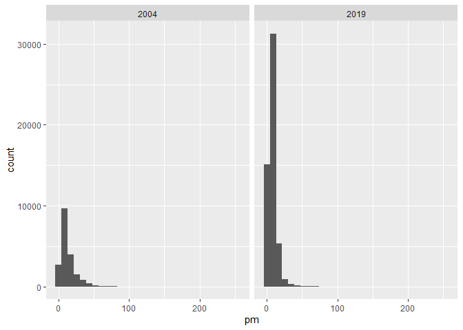<!-- -->
\#\#\# Boxplot

``` r
ggplot(df, aes(y = pm)) +
  geom_boxplot() +
  facet_wrap(. ~ year)
```

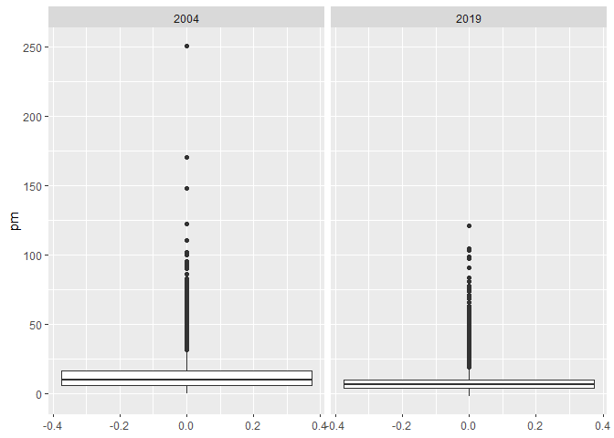<!-- -->
\#\#\# Time series

``` r
ggplot(df, aes(x=Date, y=pm)) +
  geom_line() +
  facet_wrap(. ~ year, scales = "free")
```

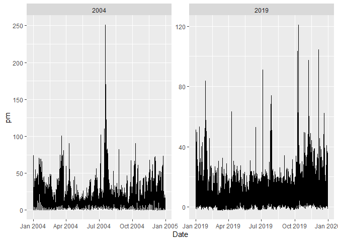<!-- -->

### Summary Stats

``` r
df %>%
  group_by(year) %>%
  summarise(mean_pm = mean(pm)
            , sd_pm = sd(pm))
```

    ## # A tibble: 2 x 3
    ##    year mean_pm sd_pm
    ##   <dbl>   <dbl> <dbl>
    ## 1  2004   13.1  10.9 
    ## 2  2019    7.73  5.81

### County Exploratory Plots

### Histogram

``` r
# Histogram
df %>%
  ggplot(aes(x = pm)) +
  geom_histogram() +
  facet_wrap(. ~ year + COUNTY, scales = "free")
```

    ## `stat_bin()` using `bins = 30`. Pick better value with `binwidth`.

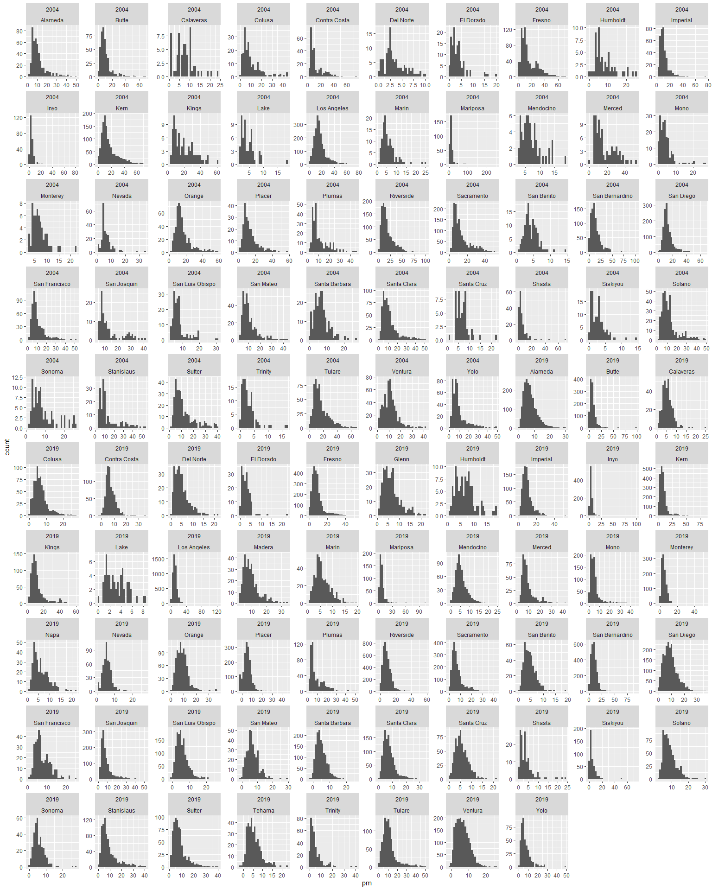<!-- -->

### Boxplot

``` r
ggplot(df, aes(y = pm)) +
  geom_boxplot() +
  facet_wrap(. ~ year + COUNTY, scales = "free")
```

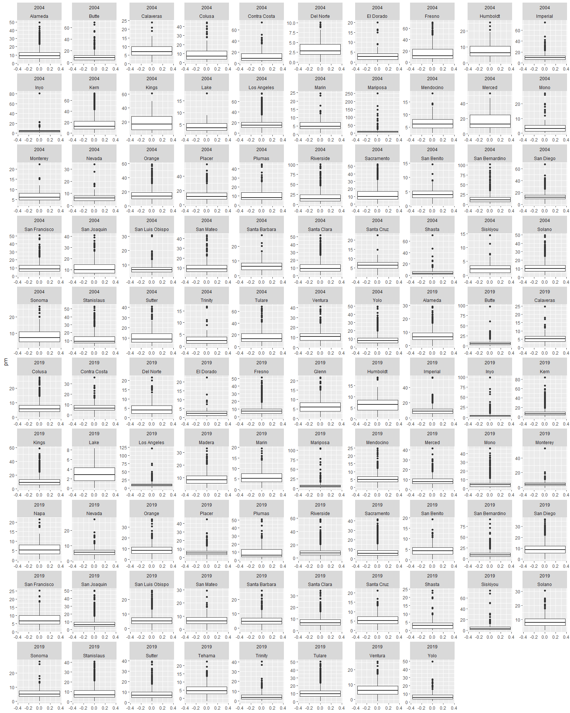<!-- -->

### Time Series

``` r
ggplot(df, aes(x=Date, y=pm)) +
  geom_line() +
  facet_wrap(. ~ year + COUNTY, scales = "free")
```

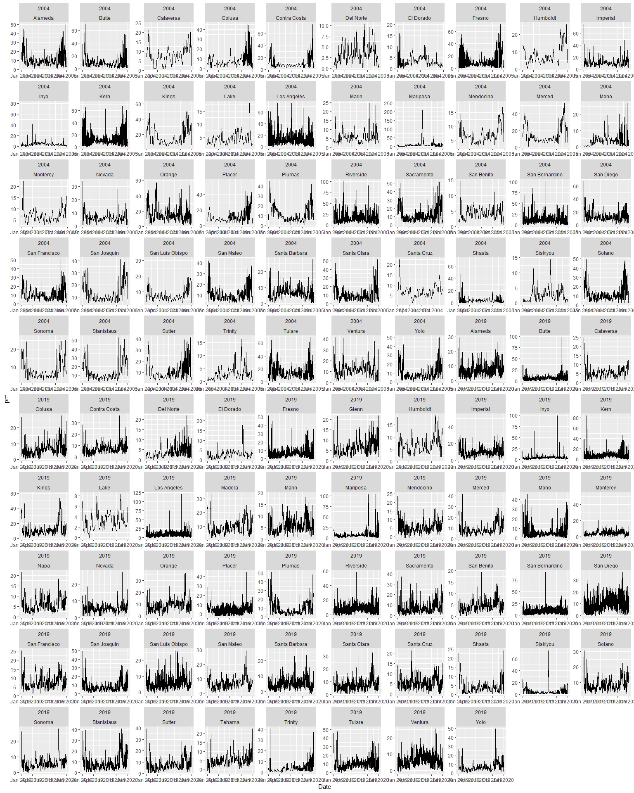<!-- -->

### Summary Stats

``` r
df %>%
  group_by(year, COUNTY) %>%
  summarise(mean_pm = mean(pm)
            , sd_pm = sd(pm)) %>%
  top_n(5, mean_pm) %>%
  arrange(desc(mean_pm), .by_group = TRUE)
```

    ## `summarise()` has grouped output by 'year'. You can override using the `.groups` argument.

    ## # A tibble: 10 x 4
    ## # Groups:   year [2]
    ##     year COUNTY         mean_pm sd_pm
    ##    <dbl> <chr>            <dbl> <dbl>
    ##  1  2004 Kings            19.7  12.7 
    ##  2  2004 Riverside        18.4  14.3 
    ##  3  2004 Merced           17.2  11.5 
    ##  4  2004 Kern             17.1  13.6 
    ##  5  2004 Los Angeles      17.1  10.7 
    ##  6  2019 Kings            12.1   9.36
    ##  7  2019 Tulare           11.2   7.65
    ##  8  2019 Los Angeles      10.2   5.80
    ##  9  2019 Madera            9.61  5.51
    ## 10  2019 San Bernardino    9.57  6.52

> The table above shows the top 5 average particulate matter air
> pollution by year and county. Los Angeles and Kings continue to be in
> the top 5 from 2004 to 2019, but the pollution levels have decrease
> dramatically.

### Site in Los Angeles Exploratory Plots

### Histogram

``` r
# Histogram
df %>%
  ggplot(aes(x = pm)) +
  geom_histogram() +
  facet_wrap(. ~ year + site, scales = "free")
```

    ## `stat_bin()` using `bins = 30`. Pick better value with `binwidth`.

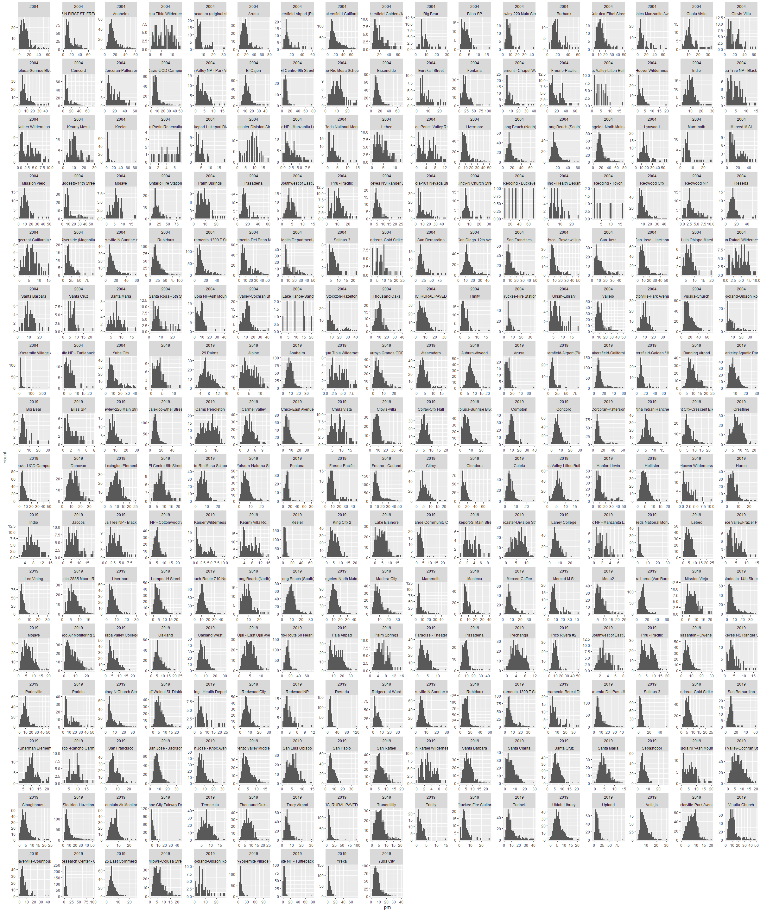<!-- -->

### Boxplot

``` r
ggplot(df, aes(y = pm)) +
  geom_boxplot() +
  facet_wrap(. ~ year + site, scales = "free")
```

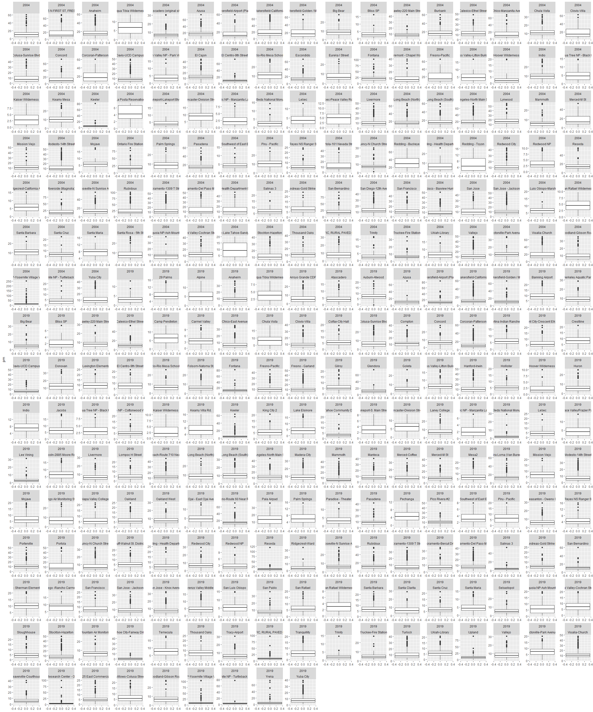<!-- -->

### Time Series

``` r
ggplot(df, aes(x=Date, y=pm)) +
  geom_line() +
  facet_wrap(. ~ year + site, scales = "free")
```

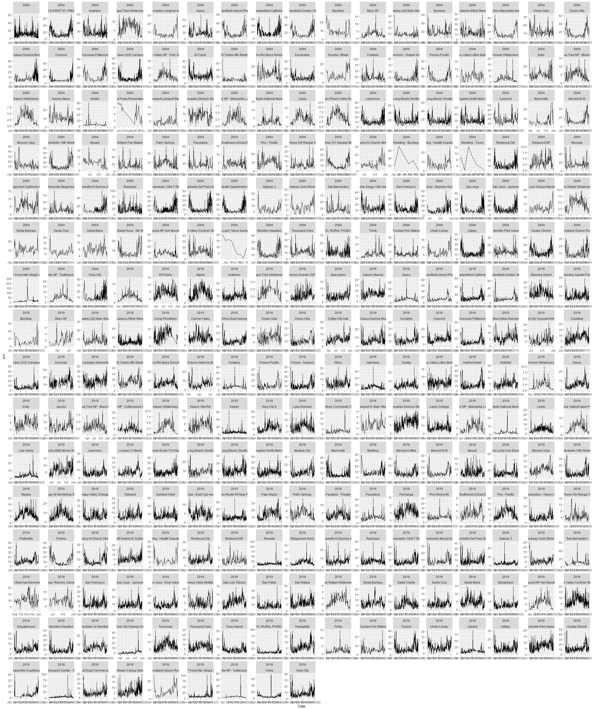<!-- -->

### Summary Stats

``` r
df %>%
  group_by(year, site) %>%
  summarise(mean_pm = mean(pm)
            , sd_pm = sd(pm)) %>%
   top_n(5, mean_pm) %>%
  arrange(desc(mean_pm), .by_group = TRUE)
```

    ## `summarise()` has grouped output by 'year'. You can override using the `.groups` argument.

    ## # A tibble: 10 x 4
    ## # Groups:   year [2]
    ##     year site                        mean_pm sd_pm
    ##    <dbl> <chr>                         <dbl> <dbl>
    ##  1  2004 Redding - Buckeye              33.6 22.5 
    ##  2  2004 Rubidoux                       23.2 15.2 
    ##  3  2004 San Bernardino                 22.0 16.0 
    ##  4  2004 Fontana                        22.0 14.5 
    ##  5  2004 Ontario Fire Station           20.9 13.7 
    ##  6  2019 Ontario-Route 60 Near Road     14.2  6.85
    ##  7  2019 Pala Airpad                    13.8  6.30
    ##  8  2019 Bakersfield-Airport (Planz)    12.9 10.5 
    ##  9  2019 Donovan                        12.8  5.63
    ## 10  2019 Mira Loma (Van Buren)          12.4  6.95

> > The table above shows the top 5 average particulate matter air
> > pollution by year and site. It is obvious that pollution levels have
> > significantly decreased since 2004.

### Quick Hypothesis Test

``` r
# Create year factor variable
# Convert to Factor
df$year_cat <- factor(df$year)

lm(pm ~ year_cat, data = df) %>%
  summary()
```

    ## 
    ## Call:
    ## lm(formula = pm ~ year_cat, data = df)
    ## 
    ## Residuals:
    ##     Min      1Q  Median      3Q     Max 
    ## -13.225  -4.334  -1.534   2.366 237.875 
    ## 
    ## Coefficients:
    ##              Estimate Std. Error t value Pr(>|t|)    
    ## (Intercept)  13.12483    0.05422  242.05   <2e-16 ***
    ## year_cat2019 -5.39104    0.06329  -85.18   <2e-16 ***
    ## ---
    ## Signif. codes:  0 '***' 0.001 '**' 0.01 '*' 0.05 '.' 0.1 ' ' 1
    ## 
    ## Residual standard error: 7.52 on 72317 degrees of freedom
    ## Multiple R-squared:  0.09119,    Adjusted R-squared:  0.09118 
    ## F-statistic:  7256 on 1 and 72317 DF,  p-value: < 2.2e-16

> This quick regression shows us that in 2019, the mean difference from
> 2004 was -5.39 in particulate matter. This effect was shown to be
> statistically signifigant (p &lt; .001)
