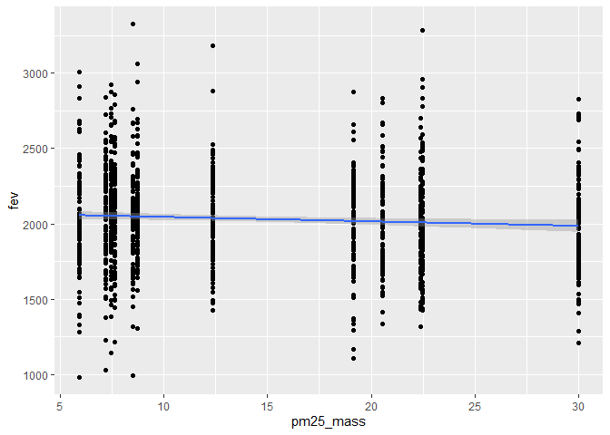

Assignment 2 - Data Viz and Wrangling
================
Eugene Nguyen
10/6/2021

## Data Wrangling

You will need to download two datasets from
<https://github.com/USCbiostats/data-science-data>.

``` r
# File names
fn1 <- "chs_individual.csv"
fn2 <- "chs_regional.csv"

# Download data

# Individual
if (!file.exists(fn1))
  download.file("https://raw.githubusercontent.com/USCbiostats/data-science-data/master/01_chs/chs_individual.csv", destfile = fn1)

# Regional
if (!file.exists(fn2))
  download.file("https://raw.githubusercontent.com/USCbiostats/data-science-data/master/01_chs/chs_regional.csv", destfile = fn2)

# Read into object
ind <- read.csv(fn1)
reg <- read.csv(fn2)
```

The individual and regional CHS datasets in 01\_chs. The individual data
includes personal and health characteristics of children in 12
communities across Southern California. The regional data include air
quality measurements at the community level. Once downloaded, you can
merge these datasets using the location variable. Once combined, you
will need to do the following:

``` r
# Merge data using location variable
df <- merge(ind, reg, by = "townname", all.x = TRUE)
```

1.  After merging the data, make sure you don’t have any duplicates by
    counting the number of rows. Make sure it matches.

``` r
# Count of final dataframe
count(df)
```

    ##      n
    ## 1 1200

``` r
# Count of original individual dataframe
count(ind)
```

    ##      n
    ## 1 1200

The dataframe and the individual dataset both have 1200 rows, there are
no duplicates.

In the case of missing values, impute data using the average within the
variables “male” and “hispanic.” If you are interested (and feel
adventurous) in the theme of Data Imputation, take a look at this paper
on “Multiple Imputation” using the Amelia R package here.

``` r
# View all columns with NA
missing <- colnames(df)[!complete.cases(t(df))]
missing
```

    ##  [1] "agepft"        "height"        "weight"        "bmi"          
    ##  [5] "asthma"        "father_asthma" "mother_asthma" "wheeze"       
    ##  [9] "hayfever"      "allergy"       "educ_parent"   "smoke"        
    ## [13] "gasstove"      "fev"           "fvc"           "mmef"         
    ## [17] "no_24hr"       "pm2_5_fr"

``` r
# Fill missing

# Mode function
getmode <- function(v) {
   uniqv <- unique(v[!is.na(v)])
   uniqv[which.max(tabulate(match(v, uniqv)))]
}

# Fill missing numeric with average
df$agepft[is.na(df$agepft)]<-mean(df$agepft,na.rm=TRUE)
df$bmi[is.na(df$bmi)]<-mean(df$bmi,na.rm=TRUE)
df$bmi[is.na(df$bmi)]<-mean(df$bmi,na.rm=TRUE)
df$fev[is.na(df$fev)]<-mean(df$fev,na.rm=TRUE)
df$fvc[is.na(df$fvc)]<-mean(df$fvc,na.rm=TRUE)
df$mmef[is.na(df$mmef)]<-mean(df$mmef,na.rm=TRUE)
df$no_24hr[is.na(df$no_24hr)]<-mean(df$no_24hr,na.rm=TRUE)
df$pm2_5_fr[is.na(df$pm2_5_fr)]<-mean(df$pm2_5_fr,na.rm=TRUE)

# Fill missing integer with mode
df$height[is.na(df$height)]<- getmode(df$height)
df$weight[is.na(df$weight)]<- getmode(df$weight)
df$asthma[is.na(df$asthma)]<- getmode(df$asthma)
df$father_asthma[is.na(df$father_asthma)]<- getmode(df$father_asthma)
df$mother_asthma[is.na(df$mother_asthma)]<- getmode(df$mother_asthma)
df$wheeze[is.na(df$wheeze)]<- getmode(df$wheeze)
df$hayfever[is.na(df$hayfever)]<- getmode(df$hayfever)
df$allergy[is.na(df$allergy)]<- getmode(df$allergy)
df$educ_parent[is.na(df$educ_parent)]<- getmode(df$educ_parent)
df$smoke[is.na(df$smoke)]<- getmode(df$smoke)
df$gasstove[is.na(df$gasstove)]<- getmode(df$gasstove)
```

2.  Create a new categorical variable named “obesity\_level” using the
    BMI measurement (underweight BMI&lt;14; normal BMI 14-22; overweight
    BMI 22-24; obese BMI&gt;24).

``` r
# Obesity Level
df <- 
  df %>%
  mutate(obesity_level = case_when(bmi < 14 ~ "underweight",
                                   bmi >= 14 & bmi < 22 ~ "normal",
                                   bmi >= 22 & bmi < 24 ~ "overweight",
                                   bmi >= 24 ~ "obese"
  ))
```

To make sure the variable is rightly coded, create a summary table that
contains the minimum BMI, maximum BMI, and the total number of
observations per category.

``` r
# Create a crosstab. Use floor to create integer BMI
table(df$obesity_level, floor(df$bmi))
```

    ##              
    ##                11  12  13  14  15  16  17  18  19  20  21  22  23  24  25  26
    ##   normal        0   0   0 104 173 180 140 197  72  58  51   0   0   0   0   0
    ##   obese         0   0   0   0   0   0   0   0   0   0   0   0   0  25  26  17
    ##   overweight    0   0   0   0   0   0   0   0   0   0   0  48  39   0   0   0
    ##   underweight   1   8  26   0   0   0   0   0   0   0   0   0   0   0   0   0
    ##              
    ##                27  28  29  30  31  32  33  34  40  41
    ##   normal        0   0   0   0   0   0   0   0   0   0
    ##   obese        13   5   5   3   2   1   1   3   1   1
    ##   overweight    0   0   0   0   0   0   0   0   0   0
    ##   underweight   0   0   0   0   0   0   0   0   0   0

It looks like the BMI counts are categorized correctly!

3.  Create another categorical variable named “smoke\_gas\_exposure”
    that summarizes “Second Hand Smoke” and “Gas Stove.” The variable
    should have four categories in total.

``` r
# Smoke Gas Exposure
df <- 
  df %>%
  mutate(smoke_gas_exposure = case_when(smoke == 0 & gasstove == 0 ~ "no exposure",
                                        smoke == 1 & gasstove == 0 ~ "smoke only",
                                        smoke == 0 & gasstove == 1 ~ "gas only",
                                        smoke == 1 & gasstove == 1 ~ "smoke & gas",
  ))

# Validate
table(df$smoke_gas_exposure)
```

    ## 
    ##    gas only no exposure smoke & gas  smoke only 
    ##         791         219         154          36

Most individuals were exposed to gas only followed by no exposure, smoke
and gas, and smoke only.

4.  Create four summary tables showing the average (or proportion, if
    binary) and sd of “Forced expiratory volume in 1 second (ml)” and
    asthma indicator by town, sex, obesity level, and
    “smoke\_gas\_exposure.”

``` r
# Town
df %>%
  group_by(townname) %>%
  summarise(mean_fev = mean(fev), sd_fev = sd(fev)) %>%
  arrange(desc(mean_fev)) %>%
  knitr::kable()
```

| townname      | mean\_fev |  sd\_fev |
|:--------------|----------:|---------:|
| Alpine        |  2086.126 | 290.8511 |
| Lake Gregory  |  2085.021 | 319.0736 |
| Atascadero    |  2076.968 | 323.5605 |
| Lake Elsinore |  2039.020 | 302.8403 |
| Lompoc        |  2037.600 | 350.3531 |
| San Dimas     |  2027.875 | 318.7055 |
| Upland        |  2027.603 | 342.4664 |
| Santa Maria   |  2023.511 | 311.1821 |
| Lancaster     |  2005.996 | 316.1541 |
| Riverside     |  1990.267 | 276.5614 |
| Mira Loma     |  1987.984 | 324.7413 |
| Long Beach    |  1987.212 | 318.9554 |

``` r
# Sex
df %>%
  group_by(male) %>%
  summarise(mean_fev = mean(fev), sd_fev = sd(fev)) %>%
  arrange(desc(mean_fev))%>%
  knitr::kable()
```

| male | mean\_fev |  sd\_fev |
|-----:|----------:|---------:|
|    1 |  2099.023 | 308.0173 |
|    0 |  1965.729 | 312.5803 |

``` r
# Obesity Level
df %>%
  group_by(obesity_level) %>%
  summarise(mean_fev = mean(fev), sd_fev = sd(fev)) %>%
  arrange(desc(mean_fev))%>%
  knitr::kable()
```

| obesity\_level | mean\_fev |  sd\_fev |
|:---------------|----------:|---------:|
| obese          |  2266.984 | 324.7539 |
| overweight     |  2224.322 | 317.4261 |
| normal         |  2001.149 | 294.4291 |
| underweight    |  1696.642 | 301.3136 |

``` r
# Smoke Gas Exposure
df %>%
  group_by(smoke_gas_exposure) %>%
  summarise(mean_fev = mean(fev), sd_fev = sd(fev)) %>%
  arrange(desc(mean_fev))%>%
  knitr::kable()
```

| smoke\_gas\_exposure | mean\_fev |  sd\_fev |
|:---------------------|----------:|---------:|
| no exposure          |  2059.080 | 327.9057 |
| smoke only           |  2056.995 | 293.0084 |
| smoke & gas          |  2025.526 | 299.8876 |
| gas only             |  2023.511 | 318.7452 |

Insights: - The town with the highest average FEV is Alpine - Males tend
to have higher average FEV than females - Individuals classified as
obese had the highest average FEV - Interestingly enough, those that
were are not exposed to smoke or gas had the highest average FEV

## Looking at the Data (EDA)

The primary questions of interest are: 1. What is the association
between BMI and FEV (forced expiratory volume)? 2. What is the
association between smoke and gas exposure and FEV? 3. What is the
association between PM2.5 exposure and FEV?

Follow the EDA checklist from week 3 and the previous assignment. Be
sure to focus on the key variables. Visualization Create the following
figures and interpret them. Be sure to include easily understandable
axes, titles, and legends.

1.  Facet plot showing scatterplots with regression lines of BMI vs FEV
    by “townname”.

``` r
# Scatterplots
ggplot(data = df, aes(x = bmi, y = fev)) +
  geom_point() +
  geom_smooth(method = "lm", se=FALSE) +
  facet_wrap(~ townname) +
  labs(x = "BMI", y = "FEV", title = "BMI vs. FEV (By Town)")
```

    ## `geom_smooth()` using formula 'y ~ x'

<!-- -->

2.  Stacked histograms of FEV by BMI category and FEV by smoke/gas
    exposure. Use different color schemes than the ggplot default.

``` r
# Stacked Histogram
ggplot(data = df, aes(x = fev, fill = obesity_level)) + 
  geom_histogram()
```

    ## `stat_bin()` using `bins = 30`. Pick better value with `binwidth`.

<!-- -->

3.  Barchart of BMI by smoke/gas exposure.

``` r
# Barchart
ggplot(df, aes(x = obesity_level, y = fev)) + 
    geom_bar(stat="identity")
```

<!-- -->

4.  Statistical summary graphs of FEV by BMI and FEV by smoke/gas
    exposure category.

``` r
# FEB & BMI
df %>%
  group_by(obesity_level) %>%
  skim(fev)
```

|                                                  |                |
|:-------------------------------------------------|:---------------|
| Name                                             | Piped data     |
| Number of rows                                   | 1200           |
| Number of columns                                | 51             |
| \_\_\_\_\_\_\_\_\_\_\_\_\_\_\_\_\_\_\_\_\_\_\_   |                |
| Column type frequency:                           |                |
| numeric                                          | 1              |
| \_\_\_\_\_\_\_\_\_\_\_\_\_\_\_\_\_\_\_\_\_\_\_\_ |                |
| Group variables                                  | obesity\_level |

Data summary

**Variable type: numeric**

| skim\_variable | obesity\_level | n\_missing | complete\_rate |    mean |     sd |      p0 |     p25 |     p50 |     p75 |    p100 | hist  |
|:---------------|:---------------|-----------:|---------------:|--------:|-------:|--------:|--------:|--------:|--------:|--------:|:------|
| fev            | normal         |          0 |              1 | 2001.15 | 294.43 |  984.85 | 1809.47 | 2028.76 | 2178.24 | 3283.37 | ▁▅▇▁▁ |
| fev            | obese          |          0 |              1 | 2266.98 | 324.75 | 1303.34 | 2058.59 | 2253.54 | 2440.40 | 3323.68 | ▁▅▇▃▁ |
| fev            | overweight     |          0 |              1 | 2224.32 | 317.43 | 1604.66 | 1990.56 | 2224.59 | 2416.59 | 2939.40 | ▃▅▇▅▂ |
| fev            | underweight    |          0 |              1 | 1696.64 | 301.31 |  995.96 | 1538.58 | 1646.77 | 1848.01 | 2355.88 | ▁▅▇▅▃ |

``` r
# FEB & Smoke/Gas Exposure
df %>%
  group_by(smoke_gas_exposure) %>%
  skim(fev)
```

|                                                  |                      |
|:-------------------------------------------------|:---------------------|
| Name                                             | Piped data           |
| Number of rows                                   | 1200                 |
| Number of columns                                | 51                   |
| \_\_\_\_\_\_\_\_\_\_\_\_\_\_\_\_\_\_\_\_\_\_\_   |                      |
| Column type frequency:                           |                      |
| numeric                                          | 1                    |
| \_\_\_\_\_\_\_\_\_\_\_\_\_\_\_\_\_\_\_\_\_\_\_\_ |                      |
| Group variables                                  | smoke\_gas\_exposure |

Data summary

**Variable type: numeric**

| skim\_variable | smoke\_gas\_exposure | n\_missing | complete\_rate |    mean |     sd |      p0 |     p25 |     p50 |     p75 |    p100 | hist  |
|:---------------|:---------------------|-----------:|---------------:|--------:|-------:|--------:|--------:|--------:|--------:|--------:|:------|
| fev            | gas only             |          0 |              1 | 2023.51 | 318.75 |  984.85 | 1815.11 | 2031.27 | 2221.71 | 3323.68 | ▁▅▇▂▁ |
| fev            | no exposure          |          0 |              1 | 2059.08 | 327.91 | 1032.00 | 1849.39 | 2031.27 | 2239.28 | 3283.37 | ▁▅▇▂▁ |
| fev            | smoke & gas          |          0 |              1 | 2025.53 | 299.89 | 1316.98 | 1821.91 | 2031.27 | 2220.31 | 2763.97 | ▂▆▇▅▂ |
| fev            | smoke only           |          0 |              1 | 2056.99 | 293.01 | 1381.95 | 1859.88 | 2031.27 | 2179.37 | 3060.00 | ▁▇▅▁▁ |

5.  A leaflet map showing the concentrations of PM2.5 mass in each of
    the CHS communities.

``` r
# Create average
pm25_avg <- 
  df %>%
  group_by(townname) %>%
  summarise(pm25_avg = mean(pm25_mass),
            lat = mean(lat),
            lon = mean(lon))

# Generating a color palette
pm.pal <- colorNumeric(c('darkgreen','goldenrod','brown'), domain = pm25_avg$pm25_avg)

pmmap <- leaflet(pm25_avg) %>% 
  # The looks of the Map
  addProviderTiles('CartoDB.Positron') %>% 
  # Some circles
  addCircles(
    lat = ~lat, lng=~lon,
                                                  # HERE IS OUR PAL!
    label = ~paste0(round(pm25_avg,2), ' C'), color = ~ pm.pal(pm25_avg),
    opacity = 1, fillOpacity = 1, radius = 500
    ) %>%
  # And a pretty legend
  addLegend('bottomleft', pal=pm.pal, values=pm25_avg$pm25_avg,
          title='PM2.5 Mass, C', opacity=1)

pmmap
```

<!-- -->

6.  Choose a visualization to examine whether PM2.5 mass is associated
    with FEV.

``` r
# Scatterplot
ggplot(df, aes(x = pm25_mass, y = fev)) +
  geom_point() +
  geom_smooth(method = "lm")
```

    ## `geom_smooth()` using formula 'y ~ x'

<!-- -->
