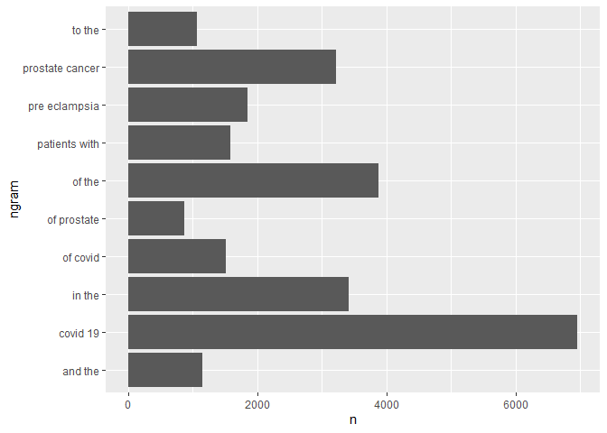

Assignment 03 - Web Scraping and Text Mining
================
Eugene Nguyen
11/5/2021

# APIs

-   Using the NCBI API, look for papers that show up under the term
    “sars-cov-2 trial vaccine.” Look for the data in the pubmed
    database, and then retrieve the details of the paper as shown in
    lab 7. How many papers were you able to find?

``` r
# Downloading the website
website <- xml2::read_html("https://pubmed.ncbi.nlm.nih.gov/?term=sars-cov-2+trial+vaccine")

# # Finding the counts
counts <- xml2::xml_find_first(website, "/html/body/main/div[9]/div[2]/div[2]/div[1]/div[1]/span")

# Turning it into text
counts <- as.character(counts)

# Extracting the data using regex
stringr::str_extract(counts, "[0-9,]+")
```

    ## [1] "2,336"

There are 2,336 papers that are found when looking up the keywords
“sars-cov-2 trial vaccine”.

-   Using the list of pubmed ids you retrieved, download each papers’
    details using the query parameter rettype = abstract. If you get
    more than 250 ids, just keep the first 250.

``` r
### Part 1
library(httr)
query_ids <- GET(
  url   = "https://eutils.ncbi.nlm.nih.gov/entrez/eutils/esearch.fcgi",
  query = list(
    db = "pubmed",
    term = "sars-cov-2 trial vaccine",
    retmax = 1000
  )
)

# Extracting the content of the response of GET
ids <- httr::content(query_ids)


### Part 2
# Turn the result into a character vector
ids <- as.character(ids)

# Find all the ids
ids <- stringr::str_extract_all(ids, "<Id>[[:digit:]]+</Id>")[[1]]

# Remove all the leading and trailing <Id> </Id>. Make use of "|"
ids <- stringr::str_remove_all(ids, "<Id>|</Id>")

# Keep the first 250 IDs
ids <- ids[1:250]

### Part 3
# Create comma separated ids
ids2 = I(paste(ids, collapse = ","))

publications <- GET(
  url   = "https://eutils.ncbi.nlm.nih.gov/entrez/eutils/efetch.fcgi",
  query = list(
    db =  "pubmed",
    id = ids2,
    retmax = 1000,
    rettype = "abstract"
    )
)

# Turning the output into character vector
publications <- httr::content(publications)
publications_txt <- as.character(publications)
```

As we did in lab 7. Create a dataset containing the following:

-   Pubmed ID number,
-   Title of the paper,
-   Name of the journal where it was published,
-   Publication date, and
-   Abstract of the paper (if any).

``` r
pub_char_list <- xml2::xml_children(publications)
pub_char_list <- sapply(pub_char_list, as.character)
```

``` r
# Abstract
abstracts <- str_extract(pub_char_list, "<Abstract>[[:print:][:space:]]+</Abstract>")
abstracts <- str_remove_all(abstracts, "</?[[:alnum:]- =\"]+>")
abstracts <- str_replace_all(abstracts, "[[:space:]]+", " ")
```

``` r
# Titles
titles <- str_extract(pub_char_list, "<ArticleTitle>[[:print:][:space:]]+</ArticleTitle>")
titles <- str_remove_all(titles, "</?[[:alnum:]- =\"]+>")
```

``` r
# Name of Journal
journal <- str_extract(pub_char_list, "<Title>[[:print:][:space:]]+</Title>")
journal <- str_remove_all(journal, "</?[[:alnum:]- =\"]+>")
journal <- str_replace_all(journal, "[[:space:]]+", " ")
```

``` r
# Date
date <- str_extract(pub_char_list, "<PubDate>[[:print:][:space:]]+</PubDate>")
date <- str_remove_all(date, "</?[[:alnum:]- =\"]+>")
date <- str_replace_all(date, "[[:space:]]+", " ")
```

``` r
# Create a database
database <- data.frame(
  Journal = journal,
  Date = date,
  PubMedID = ids,
  Title = titles,
  Abstract = abstracts
)
knitr::kable(database[1:20, ], caption = "Abstracts of sars-cov-2 trial vaccine Papers")
```

| Journal                                                                                              | Date        | PubMedID | Title                                                                                                                                                                              | Abstract                                                                                                                                                                                                                                                                                                                                                                                                                                                                                                                                                                                                                                                                                                                                                                                                                                                                                                                                                                                                                                                                                                                                                                                                                                                                                                                                                                                                                                                                                                                                                                                                                                                                                                                                                                                                                                                                                                                                                                                                                                                                                                                                                                                                                                                                                                                                                                                                                                                                                                          |
|:-----------------------------------------------------------------------------------------------------|:------------|:---------|:-----------------------------------------------------------------------------------------------------------------------------------------------------------------------------------|:------------------------------------------------------------------------------------------------------------------------------------------------------------------------------------------------------------------------------------------------------------------------------------------------------------------------------------------------------------------------------------------------------------------------------------------------------------------------------------------------------------------------------------------------------------------------------------------------------------------------------------------------------------------------------------------------------------------------------------------------------------------------------------------------------------------------------------------------------------------------------------------------------------------------------------------------------------------------------------------------------------------------------------------------------------------------------------------------------------------------------------------------------------------------------------------------------------------------------------------------------------------------------------------------------------------------------------------------------------------------------------------------------------------------------------------------------------------------------------------------------------------------------------------------------------------------------------------------------------------------------------------------------------------------------------------------------------------------------------------------------------------------------------------------------------------------------------------------------------------------------------------------------------------------------------------------------------------------------------------------------------------------------------------------------------------------------------------------------------------------------------------------------------------------------------------------------------------------------------------------------------------------------------------------------------------------------------------------------------------------------------------------------------------------------------------------------------------------------------------------------------------|
| Cell                                                                                                 | 2021 Oct 16 | 34735795 | Immunogenicity of standard and extended dosing intervals of BNT162b2 mRNA vaccine.                                                                                                 | Extension of the interval between vaccine doses for the BNT162b2 mRNA vaccine was introduced in the United Kingdom to accelerate population coverage with a single dose. At this time, trial data were lacking, and we addressed this in a study of United Kingdom healthcare workers. The first vaccine dose induced protection from infection from the circulating alpha (B.1.1.7) variant over several weeks. In a substudy of 589 individuals, we show that this single dose induces severe acute respiratory syndrome coronavirus 2 (SARS-CoV-2) neutralizing antibody (NAb) responses and a sustained B and T cell response to the spike protein. NAb levels were higher after the extended dosing interval (6-14 weeks) compared with the conventional 3- to 4-week regimen, accompanied by enrichment of CD4+ T cells expressing interleukin-2 (IL-2). Prior SARS-CoV-2 infection amplified and accelerated the response. These data on dynamic cellular and humoral responses indicate that extension of the dosing interval is an effective immunogenic protocol. Copyright © 2021 The Author(s). Published by Elsevier Inc. All rights reserved.                                                                                                                                                                                                                                                                                                                                                                                                                                                                                                                                                                                                                                                                                                                                                                                                                                                                                                                                                                                                                                                                                                                                                                                                                                                                                                                                                       |
| MMWR. Morbidity and mortality weekly report                                                          | 2021 Nov 05 | 34735426 | Effectiveness of 2-Dose Vaccination with mRNA COVID-19 Vaccines Against COVID-19-Associated Hospitalizations Among Immunocompromised Adults - Nine States, January-September 2021. | Immunocompromised persons, defined as those with suppressed humoral or cellular immunity resulting from health conditions or medications, account for approximately 3% of the U.S. adult population (1). Immunocompromised adults are at increased risk for severe COVID-19 outcomes (2) and might not acquire the same level of protection from COVID-19 mRNA vaccines as do immunocompetent adults (3,4). To evaluate vaccine effectiveness (VE) among immunocompromised adults, data from the VISION Network\* on hospitalizations among persons aged =18 years with COVID-19-like illness from 187 hospitals in nine states during January 17-September 5, 2021 were analyzed. Using selected discharge diagnoses,† VE against COVID-19-associated hospitalization conferred by completing a 2-dose series of an mRNA COVID-19 vaccine =14 days before the index hospitalization date§ (i.e., being fully vaccinated) was evaluated using a test-negative design comparing 20,101 immunocompromised adults (10,564 \[53%\] of whom were fully vaccinated) and 69,116 immunocompetent adults (29,456 \[43%\] of whom were fully vaccinated). VE of 2 doses of mRNA COVID-19 vaccine against COVID-19-associated hospitalization was lower among immunocompromised patients (77%; 95% confidence interval \[CI\] = 74%-80%) than among immunocompetent patients (90%; 95% CI = 89%-91%). This difference persisted irrespective of mRNA vaccine product, age group, and timing of hospitalization relative to SARS-CoV-2 (the virus that causes COVID-19) B.1.617.2 (Delta) variant predominance in the state of hospitalization. VE varied across immunocompromising condition subgroups, ranging from 59% (organ or stem cell transplant recipients) to 81% (persons with a rheumatologic or inflammatory disorder). Immunocompromised persons benefit from mRNA COVID-19 vaccination but are less protected from severe COVID-19 outcomes than are immunocompetent persons, and VE varies among immunocompromised subgroups. Immunocompromised persons receiving mRNA COVID-19 vaccines should receive 3 doses and a booster, consistent with CDC recommendations (5), practice nonpharmaceutical interventions, and, if infected, be monitored closely and considered early for proven therapies that can prevent severe outcomes.                                                                                                                                                                          |
| Toxicological sciences : an official journal of the Society of Toxicology                            | 2021 Nov 04 | 34735018 | COVID-19 Therapeutics and Vaccines: A Race to save Lives.                                                                                                                          | COVID-19 (Coronavirus Disease 2019), the disease caused by SARS-CoV-2 (Severe Acute Respiratory Syndrome Coronavirus-2) is an ongoing global public health emergency. As understanding of the health effects of COVID-19 have improved, companies and agencies worldwide have worked together to identify therapeutic approaches, fast-track clinical trials and pathways for emergency use, and approve therapies for patients. This work has resulted in therapies that not only improve survival, reduce time of hospitalization and time to recovery, but also include preventative measures, such as vaccines. This manuscript discusses development programs for three products that are approved or authorized for emergency use at the time of writing: VEKLURY (remdesivir, direct acting antiviral from Gilead Sciences, Inc.), REGEN-COV (casirivimab and imdevimab antibody cocktail from Regeneron Pharmaceuticals Inc.) and Comirnaty (Pfizer-BioNTech COVID-19 Vaccine \[Pfizer, Inc.-BioNTech\]), and perspectives from the US Food and Drug Administration (FDA). Published by Oxford University Press 2021.                                                                                                                                                                                                                                                                                                                                                                                                                                                                                                                                                                                                                                                                                                                                                                                                                                                                                                                                                                                                                                                                                                                                                                                                                                                                                                                                                                                     |
| The Lancet regional health. Europe                                                                   | 2021 Oct 28 | 34729549 | Adverse events of active and placebo groups in SARS-CoV-2 vaccine randomized trials: A systematic review.                                                                          | For safety assessment in clinical trials, adverse events (AEs) are reported for the drug under evaluation and compared with AEs in the placebo group. Little is known about the nature of the AEs associated with clinical trials of SARS-CoV-2 vaccines and the extent to which these can be traced to nocebo effects, where negative treatment-related expectations favor their occurrence. In our systematic review, we compared the rates of solicited AEs in the active and placebo groups of SARS-CoV-2 vaccines approved by the Western pharmaceutical regulatory agencies.We implemented a search strategy to identify trial-III studies of SARS-CoV-2 vaccines through the PubMed database. We adopted the PRISMA Statement to perform the study selection and the data collection and identified three trial: two mRNA-based (37590 participants) and one adenovirus type (6736 participants). Relative risks showed that the occurrence of AEs reported in the vaccine groups was higher compared with the placebo groups. The most frequently AEs in both groups were fatigue, headache, local pain, as injection site reactions, and myalgia. In particular, for first doses in placebo recipients, fatigue was reported in 29% and 27% in BNT162b2 and mRNA-1273 groups, respectively, and in 21% of Ad26.COV2.S participants. Headache was reported in 27% in both mRNA groups and in 24% of Ad26.COV2.S recipients. Myalgia was reported in 10% and 14% in mRNA groups (BNT162b2 and mRNA-1273, respectively) and in 13% of Ad26.COV2.S participants. Local pain was reported in 12% and 17% in mRNA groups (BNT162b2 and mRNA-1273, respectively), and in 17% of Ad26.COV2.S recipients. These AEs are more common in the younger population and in the first dose of placebo recipients of the mRNA vaccines. Our results are in agreement with the expectancy theory of nocebo effects and suggest that the AEs associated with COVID-19 vaccines may be related to the nocebo effect. Fondazione CRT - Cassa di Risparmio di Torino, IT (grant number 66346, “GAIA-MENTE” 2019). © 2021 The Authors.                                                                                                                                                                                                                                                                                                                                                                                          |
| JAMA network open                                                                                    | 2021 11 01  | 34726743 | Analysis of the Effectiveness of the Ad26.COV2.S Adenoviral Vector Vaccine for Preventing COVID-19.                                                                                | Continuous assessment of the effectiveness and safety of the US Food and Drug Administration-authorized SARS-CoV-2 vaccines is critical to amplify transparency, build public trust, and ultimately improve overall health outcomes. To evaluate the effectiveness of the Johnson & Johnson Ad26.COV2.S vaccine for preventing SARS-CoV-2 infection. <AbstractText Label="Design, Setting, and Participants">This comparative effectiveness research study used large-scale longitudinal curation of electronic health records from the multistate Mayo Clinic Health System (Minnesota, Arizona, Florida, Wisconsin, and Iowa) to identify vaccinated and unvaccinated adults between February 27 and July 22, 2021. The unvaccinated cohort was matched on a propensity score derived from age, sex, zip code, race, ethnicity, and previous number of SARS-CoV-2 polymerase chain reaction tests. The final study cohort consisted of 8889 patients in the vaccinated group and 88 898 unvaccinated matched patients. Single dose of the Ad26.COV2.S vaccine. The incidence rate ratio of SARS-CoV-2 infection in the vaccinated vs unvaccinated control cohorts, measured by SARS-CoV-2 polymerase chain reaction testing. The study was composed of 8889 vaccinated patients (4491 men \[50.5%\]; mean \[SD\] age, 52.4 \[16.9\] years) and 88 898 unvaccinated patients (44 748 men \[50.3%\]; mean \[SD\] age, 51.7 \[16.7\] years). The incidence rate ratio of SARS-CoV-2 infection in the vaccinated vs unvaccinated control cohorts was 0.26 (95% CI, 0.20-0.34) (60 of 8889 vaccinated patients vs 2236 of 88 898 unvaccinated individuals), which corresponds to an effectiveness of 73.6% (95% CI, 65.9%-79.9%) and a 3.73-fold reduction in SARS-CoV-2 infections. This study’s findings are consistent with the clinical trial-reported efficacy of Ad26.COV2.S and the first retrospective analysis, suggesting that the vaccine is effective at reducing SARS-CoV-2 infection, even with the spread of variants such as Alpha or Delta that were not present in the original studies, and reaffirm the urgent need to continue mass vaccination efforts globally.                                                                                                                                                                                                                                                                                                                               |
| Israel journal of health policy research                                                             | 2021 10 29  | 34715931 | Lessons from Israel’s COVID-19 Green Pass program.                                                                                                                                 | As of the beginning of March 2021, Israeli law requires the presentation of a Green Pass as a precondition for entering certain businesses and public spheres. Entitlement for a Green Pass is granted to Israelis who have been vaccinated with two doses of COVID-19 vaccine, who have recovered from COVID-19, or who are participating in a clinical trial for vaccine development in Israel. The Green Pass is essential for retaining immune individuals’ freedom of movement and for promoting the public interest in reopening the economic, educational, and cultural spheres of activity. Nonetheless, and as the Green Pass imposes restrictions on the movement of individuals who had not been vaccinated or who had not recovered, it is not consonant with solidarity and trust building. Implementing the Green Pass provision while advancing its effectiveness on the one hand, and safeguarding equality, proportionality, and fairness on the other hand may imbue this measure with ethical legitimacy despite involving a potential breach of trust and solidarity. © 2021. The Author(s).                                                                                                                                                                                                                                                                                                                                                                                                                                                                                                                                                                                                                                                                                                                                                                                                                                                                                                                                                                                                                                                                                                                                                                                                                                                                                                                                                                                                  |
| Journal of medical virology                                                                          | 2021 Oct 29 | 34713912 | Vaccine development and technology for SARS-CoV-2: current insights.                                                                                                               | SARS-CoV-2 is associated to a severe respiratory disease in China, that rapidly spread across continents. Since the beginning of the pandemic, available data suggested the asymptomatic transmission and patients were treated with specific drugs with efficacy and safety data not always satisfactory. The aim of this review is to describe the vaccines developed by three companies, Pfizer-BioNTech, Moderna and University of Oxford/AstraZeneca, in terms of both technological and pharmaceutical formulation, safety, efficacy and immunogenicity. A critical analysis of phase 1, 2 and 3 clinical trial results available was conducted, comparing the three vaccine candidates, underlining their similarities and differences. All candidates showed consistent efficacy and tolerability; although some differences can be noted, such as their technological formulation, temperature storage, which will be related to logistics and costs. Further studies will be necessary to evaluate long-term effects and to assess the vaccine safety and efficacy in the general population. This article is protected by copyright. All rights reserved. This article is protected by copyright. All rights reserved.                                                                                                                                                                                                                                                                                                                                                                                                                                                                                                                                                                                                                                                                                                                                                                                                                                                                                                                                                                                                                                                                                                                                                                                                                                                                                 |
| BMJ open                                                                                             | 2021 10 28  | 34711598 | BCG vaccination to reduce the impact of COVID-19 in healthcare workers: Protocol for a randomised controlled trial (BRACE trial).                                                  | BCG vaccination modulates immune responses to unrelated pathogens. This off-target effect could reduce the impact of emerging pathogens. As a readily available, inexpensive intervention that has a well-established safety profile, BCG is a good candidate for protecting healthcare workers (HCWs) and other vulnerable groups against COVID-19. This international multicentre phase III randomised controlled trial aims to determine if BCG vaccination reduces the incidence of symptomatic and severe COVID-19 at 6 months (co-primary outcomes) compared with no BCG vaccination. We plan to randomise 10 078 HCWs from Australia, The Netherlands, Spain, the UK and Brazil in a 1:1 ratio to BCG vaccination or no BCG (control group). The participants will be followed for 1 year with questionnaires and collection of blood samples. For any episode of illness, clinical details will be collected daily, and the participant will be tested for SARS-CoV-2 infection. The secondary objectives are to determine if BCG vaccination reduces the rate, incidence, and severity of any febrile or respiratory illness (including SARS-CoV-2), as well as work absenteeism. The safety of BCG vaccination in HCWs will also be evaluated. Immunological analyses will assess changes in the immune system following vaccination, and identify factors associated with susceptibility to or protection against SARS-CoV-2 and other infections. Ethical and governance approval will be obtained from participating sites. Results will be published in peer-reviewed open-access journals. The final cleaned and locked database will be deposited in a data sharing repository archiving system. ClinicalTrials.gov NCT04327206. © Author(s) (or their employer(s)) 2021. Re-use permitted under CC BY. Published by BMJ.                                                                                                                                                                                                                                                                                                                                                                                                                                                                                                                                                                                                                                                                         |
| Journal of general internal medicine                                                                 | 2021 Oct 26 | 34704204 | COVID-19 Testing and Vaccine Acceptability Among Homeless-Experienced Adults: Qualitative Data from Two Samples.                                                                   | Homeless-experienced populations are at increased risk of exposure to SARS-CoV-2 due to their living environments and face an increased risk of severe COVID-19 disease due to underlying health conditions. Little is known about COVID-19 testing and vaccination acceptability among homeless-experienced populations. To understand the facilitators and barriers to COVID-19 testing and vaccine acceptability among homeless-experienced adults. We conducted in-depth interviews with participants from July to October 2020. We purposively recruited participants from (1) a longitudinal cohort of homeless-experienced older adults in Oakland, CA (n=37) and (2) a convenience sample of people (n=57) during a mobile outreach COVID-19 testing event in San Francisco. Adults with current or past experience of homelessness. We asked participants about their experiences with and attitudes towards COVID-19 testing and their perceptions of COVID-19 vaccinations. We used participant observation techniques to document the interactions between testing teams and those approached for testing. We audio-recorded, transcribed, and content analyzed all interviews and identified major themes and subthemes. Participants found incentivized COVID-19 testing administered in unsheltered settings and supported by community health outreach workers (CHOWs) to be acceptable. The majority of participants expressed a positive inclination toward vaccine acceptability, citing a desire to return to routine life and civic responsibility. Those who expressed hesitancy cited a desire to see trial data, concerns that vaccines included infectious materials, and mistrust of the government. Participants expressed positive evaluations of the incentivized, mobile COVID-19 testing supported by CHOWs in unsheltered settings. The majority of participants expressed a positive inclination toward vaccination. Vaccine hesitancy concerns must be addressed when designing vaccine delivery strategies that overcome access challenges. Based on the successful implementation of COVID-19 testing, we recommend mobile delivery of vaccines using trusted CHOWs to address concerns and facilitate wider access to and uptake of the COVID vaccine. © 2021. Society of General Internal Medicine.                                                                                                                                                                         |
| Cureus                                                                                               | 2021 Sep    | 34703690 | A Rare Variant of Guillain-Barre Syndrome Following Ad26.COV2.S Vaccination.                                                                                                       | Efforts to combat the global pandemic caused by severe acute respiratory syndrome coronavirus 2 (SARS-CoV-2) range from adequate diagnostic testing and contract tracing to vaccination for the prevention of coronavirus disease 2019 (COVID-19). In the United States alone, three vaccinations have been authorized for emergency use (EUA) or approved to prevent COVID-19. The Ad26.COV2.S vaccine by Johnson and Johnson (New Brunswick, New Jersey) is the only adenovirus-based vaccine and deemed relatively effective and safe by the US Food and Drug Administration (FDA) following its clinical trial. Since its introduction, the US FDA has placed a warning on the vaccine adverse event reporting system (VAERS) after more than 100 cases of Guillain-Barre Syndrome (GBS) were reported. Herein, we outline the hospital course of a generally healthy 49-year-old female who experienced an axonal form of GBS nine days after receiving the Ad26.COV2.S vaccine. Copyright © 2021, Morehouse et al.                                                                                                                                                                                                                                                                                                                                                                                                                                                                                                                                                                                                                                                                                                                                                                                                                                                                                                                                                                                                                                                                                                                                                                                                                                                                                                                                                                                                                                                                                          |
| Journal for immunotherapy of cancer                                                                  | 2021 10     | 34702753 | Humoral immunogenicity of the seasonal influenza vaccine before and after CAR-T-cell therapy: a prospective observational study.                                                   | Recipients of chimeric antigen receptor-modified T (CAR-T) cell therapies for B cell malignancies have profound and prolonged immunodeficiencies and are at risk for serious infections, including respiratory virus infections. Vaccination may be important for infection prevention, but there are limited data on vaccine immunogenicity in this population. We conducted a prospective observational study of the humoral immunogenicity of commercially available 2019-2020 inactivated influenza vaccines in adults immediately prior to or while in durable remission after CD19-, CD20-, or B cell maturation antigen-targeted CAR-T-cell therapy, as well as controls. We tested for antibodies to all four vaccine strains using neutralization and hemagglutination inhibition (HAI) assays. Antibody responses were defined as at least fourfold titer increases from baseline. Seroprotection was defined as a HAI titer =40. Enrolled CAR-T-cell recipients were vaccinated 14-29 days prior to (n=5) or 13-57 months following therapy (n=13), and the majority had hypogammaglobulinemia and cellular immunodeficiencies prevaccination. Eight non-immunocompromised adults served as controls. Antibody responses to =1 vaccine strain occurred in 2 (40%) individuals before CAR-T-cell therapy and in 4 (31%) individuals vaccinated after CAR-T-cell therapy. An additional 1 (20%) and 6 (46%) individuals had at least twofold increases, respectively. One individual vaccinated prior to CAR-T-cell therapy maintained a response for &gt;3 months following therapy. Across all tested vaccine strains, seroprotection was less frequent in CAR-T-cell recipients than in controls. There was evidence of immunogenicity even among individuals with low immunoglobulin, CD19+ B cell, and CD4+ T-cell counts. These data support consideration for vaccination before and after CAR-T-cell therapy for influenza and other relevant pathogens such as SARS-CoV-2, irrespective of hypogammaglobulinemia or B cell aplasia. However, relatively impaired humoral vaccine immunogenicity indicates the need for additional infection-prevention strategies. Larger studies are needed to refine our understanding of potential correlates of vaccine immunogenicity, and durability of immune responses, in CAR-T-cell therapy recipients. © Author(s) (or their employer(s)) 2021. Re-use permitted under CC BY-NC. No commercial re-use. See rights and permissions. Published by BMJ. |
| Clinical infectious diseases : an official publication of the Infectious Diseases Society of America | 2021 Oct 26 | 34698827 | Measuring vaccine efficacy against infection and disease in clinical trials: sources and magnitude of bias in COVID-19 vaccine efficacy estimates.                                 | Phase III trials have estimated COVID-19 vaccine efficacy (VE) against symptomatic and asymptomatic infection. We explore the direction and magnitude of potential biases in these estimates and their implications for vaccine protection against infection and against disease in breakthrough infections. We developed a mathematical model that accounts for natural and vaccine-induced immunity, changes in serostatus and imperfect sensitivity and specificity of tests for infection and antibodies. We estimated expected biases in VE against symptomatic, asymptomatic and any SARS&lt;U+034F&gt;CoV2 infections and against disease following infection for a range of vaccine characteristics and measurement approaches, and the likely overall biases for published trial results that included asymptomatic infections. VE against asymptomatic infection measured by PCR or serology is expected to be low or negative for vaccines that prevent disease but not infection. VE against any infection is overestimated when asymptomatic infections are less likely to be detected than symptomatic infections and the vaccine protects against symptom development. A competing bias towards underestimation arises for estimates based on tests with imperfect specificity, especially when testing is performed frequently. Our model indicates considerable uncertainty in Oxford-AstraZeneca ChAdOx1 and Janssen Ad26.COV2.S VE against any infection, with slightly higher than published, bias-adjusted values of 59.0% (95% uncertainty interval \[UI\] 38.4 to 77.1) and 70.9% (95% UI 49.8 to 80.7) respectively. Multiple biases are likely to influence COVID-19 VE estimates, potentially explaining the observed difference between ChAdOx1 and Ad26.COV2.S vaccines. These biases should be considered when interpreting both efficacy and effectiveness study results. © The Author(s) 2021. Published by Oxford University Press for the Infectious Diseases Society of America.                                                                                                                                                                                                                                                                                                                                                                                                                                                                                                |
| Neurology                                                                                            | 2021 10 26  | 34697214 | Author Response: Guillain-Barré Syndrome in the Placebo and Active Arms of a COVID-19 Vaccine Clinical Trial.                                                                      | NA                                                                                                                                                                                                                                                                                                                                                                                                                                                                                                                                                                                                                                                                                                                                                                                                                                                                                                                                                                                                                                                                                                                                                                                                                                                                                                                                                                                                                                                                                                                                                                                                                                                                                                                                                                                                                                                                                                                                                                                                                                                                                                                                                                                                                                                                                                                                                                                                                                                                                                                |
| Neurology                                                                                            | 2021 10 26  | 34697213 | Reader Response: Guillain-Barré Syndrome in the Placebo and Active Arms of a COVID-19 Vaccine Clinical Trial.                                                                      | NA                                                                                                                                                                                                                                                                                                                                                                                                                                                                                                                                                                                                                                                                                                                                                                                                                                                                                                                                                                                                                                                                                                                                                                                                                                                                                                                                                                                                                                                                                                                                                                                                                                                                                                                                                                                                                                                                                                                                                                                                                                                                                                                                                                                                                                                                                                                                                                                                                                                                                                                |
| Vaccines                                                                                             | 2021 Oct 19 | 34696316 | Characterization of Individuals Interested in Participating in a Phase I SARS-CoV-2 Vaccine Trial.                                                                                 | The development of an effective vaccine against SARS-CoV-2 marks one of the highest priorities during the ongoing pandemic. However, recruitment of participants for clinical trials can be challenging, and recruitment failure is among the most common reasons for discontinuation in clinical trials. From 20 May 2020, public announcements about a planned phase I trial of the vaccine candidate MVA-SARS-2-S against SARS-CoV-2 began, and interested individuals started contacting the study team via designated e-mail. All emails received from these individuals between 20 May 2020-30 September 2020 were assessed. Of the 2541 interested volunteers, 62% contacted the study team within three days after the first media announcement. The average age was 61 years (range 16-100), 48% of volunteers were female and 52% male. A total of 274, 186, and 53 individuals, respectively, reported medical pre-conditions, were health-care workers, or had frequent inter-person contacts. In conclusion, we report a high number of volunteers, with a considerable percentage stating factors for an elevated risk to acquire COVID-19 or develop severe disease. Factors such as media coverage and the perception of a disease as an acute threat may influence the individual’s choice to volunteer for a vaccine trial. Our data provide first important insights to better understand reasons to participate in such trials to facilitate trial implementation and recruitment.                                                                                                                                                                                                                                                                                                                                                                                                                                                                                                                                                                                                                                                                                                                                                                                                                                                                                                                                                                                                            |
| Vaccines                                                                                             | 2021 Oct 03 | 34696233 | Antibody Persistence 6 Months Post-Vaccination with BNT162b2 among Health Care Workers.                                                                                            | We present immunogenicity data 6 months after the first dose of BNT162b2 in correlation with age, gender, BMI, comorbidities and previous SARS-CoV-2 infection. An immunogenicity evaluation was carried out among health care workers (HCW) vaccinated at the Istituti Fisioterapici Ospitalieri (IFO). All HCW were asked to be vaccine by the national vaccine campaign at the beginning of 2021. Serum samples were collected on day 1 just prior to the first dose of the vaccine and on day 21 just prior to the second vaccination dose. Thereafter sera samples were collected 28, 49, 84 and 168 days after the first dose of BNT162b2. Quantitative measurement of IgG antibodies against S1/S2 antigens of SARS-CoV-2 was performed with a commercial chemiluminescent immunoassay. Two hundred seventy-four HWCs were analyzed, 175 women (63.9%) and 99 men (36.1%). The maximum antibody geometric mean concentration (AbGMC) was reached at T2 (299.89 AU/mL; 95% CI: 263.53-339.52) with a significant increase compared to baseline (p &lt; 0.0001). Thereafter, a progressive decrease was observed. At T5, a median decrease of 59.6% in COVID-19 negative, and of 67.8% in COVID-19 positive individuals were identified with respect to the highest antibody response. At T1, age and previous COVID-19 were associated with differences in antibody response, while at T2 and T3 differences in immune response were associated with age, gender and previous COVID-19. At T4 and T5, only COVID-19 positive participants demonstrated a greater antibody response, whereas no other variables seemed to influence antibody levels. Overall our study clearly shows antibody persistence at 6 months, albeit with a certain decline. Thus, the use of this vaccine in addressing the COVID-19 pandemic is supported by our results that in turn open debate about the need for further boosts.                                                                                                                                                                                                                                                                                                                                                                                                                                                                                                                                                                                              |
| Vaccines                                                                                             | 2021 Sep 28 | 34696198 | A Retrospective Cross-Sectional Study Assessing Self-Reported Adverse Events following Immunization (AEFI) of the COVID-19 Vaccine in Bangladesh.                                  | The Oxford-AstraZeneca vaccine (Covishield) was the first to be introduced in Bangladesh to fight the ongoing global COVID-19 pandemic. As this vaccine had shown some side-effects in its clinical trial, we aimed to conduct a study assessing short-term adverse events following immunization (AEFIs) in Bangladesh. A cross-sectional study was conducted on social and electronic media platforms by delivering an online questionnaire among people who had taken at least one dose of the COVID-19 vaccine. The collected data were then analysed to evaluate various parameters related to the AEFIs of the respondents. A total of 626 responses were collected. Of these, 623 were selected based on complete answers and used for the analysis. Most of the respondents were between 30-60 years of age, and 40.4% were female. We found that a total of 8.5% of the total respondents had been infected with the SARS-CoV-2 virus. Our survey revealed that out of 623 volunteers, 317 reported various side-effects after taking the vaccine, which is about 50.88% of the total participants. The majority of participants (37.07%, 231/623) reported swelling and pain at the injection site and fever (25.84%, 162/623); these were some of the common localized and generalized symptoms after the COVID-19 vaccine administration. The side-effects reported after receiving the Oxford-AstraZeneca vaccine (Covishield) are similar to those reported in clinical trials, demonstrating that the vaccines have a safe therapeutic window. Moreover, further research is needed to determine the efficacy of existing vaccines in preventing SARS-CoV-2 infections or after-infection hospitalization.                                                                                                                                                                                                                                                                                                                                                                                                                                                                                                                                                                                                                                                                                                                                                                                         |
| Frontiers in immunology                                                                              | 2021        | 34691078 | Functional Effects of Receptor-Binding Domain Mutations of SARS-CoV-2 B.1.351 and P.1 Variants.                                                                                    | The recent identification and rise to dominance of the P.1 and B.1.351 SARS-CoV-2 variants have brought international concern because they may confer fitness advantages. The same three positions in the receptor-binding domain (RBD) are affected in both variants, but where the 417 substitution differs, the E484K/N501Y have co-evolved by convergent evolution. Here we characterize the functional and immune evasive consequences of the P.1 and B.1.351 RBD mutations. E484K and N501Y result in gain-of-function with two different outcomes: The N501Y confers a ten-fold affinity increase towards ACE-2, but a modest antibody evasion potential of plasma from convalescent or vaccinated individuals, whereas the E484K displays a significant antibody evasion capacity without a major impact on affinity. On the other hand, the two different 417 substitutions severely impair the RBD/ACE-2 affinity, but in the combined P.1 and B.1.351 RBD variants, this effect is partly counterbalanced by the effect of the E484K and N501Y. Our results suggest that the combination of these three mutations is a two-step forward and one step back in terms of viral fitness. Copyright © 2021 Bayarri-Olmos, Jarlhelt, Johnsen, Hansen, Helgstrand, Rose Bjelke, Matthiesen, Nielsen, Iversen, Ostrowski, Bundgaard, Frikke-Schmidt, Garred and Skjoedt.                                                                                                                                                                                                                                                                                                                                                                                                                                                                                                                                                                                                                                                                                                                                                                                                                                                                                                                                                                                                                                                                                                                                       |
| Frontiers in immunology                                                                              | 2021        | 34691071 | Heterologous Ad26.COV2.S Prime and mRNA-Based Boost COVID-19 Vaccination Regimens: The SWITCH Trial Protocol.                                                                      | NA                                                                                                                                                                                                                                                                                                                                                                                                                                                                                                                                                                                                                                                                                                                                                                                                                                                                                                                                                                                                                                                                                                                                                                                                                                                                                                                                                                                                                                                                                                                                                                                                                                                                                                                                                                                                                                                                                                                                                                                                                                                                                                                                                                                                                                                                                                                                                                                                                                                                                                                |
| Cornea                                                                                               | 2021 Oct 23 | 34690266 | Acute Corneal Transplant Rejection After Severe Acute Respiratory Syndrome Coronavirus 2 mRNA-1273 Vaccination.                                                                    | The purpose of this article was to report a case of full-thickness corneal transplant rejection 3 days after immunization with the severe acute respiratory syndrome coronavirus 2 (SARS-CoV-2) Moderna mRNA-1273 vaccine. Case Report. A 51-year-old man with a history of keratoconus and penetrating keratoplasty underwent repeat penetrating keratoplasty for graft failure. The patient had an uncomplicated intraoperative and postoperative course with improved vision and a healthy graft. The patient received the SARS-CoV-2 Moderna vaccine on postoperative week 3, and within 3 days, the patient began developing eye pain, photophobia, and blurred vision. The patient was found to have graft rejection with corneal edema and endothelial keratic precipitates. The rejection did not improve despite a trial of increased topical steroids and ultimately evolved into graft failure. To the best of our knowledge, this case of full-thickness graft rejection after the Moderna SARS-CoV-2 mRNA vaccination is the first to be reported worldwide. The temporal relationship between vaccination and subsequent rejection is highly suggestive of causation due to the short interval (3 days) between vaccination and rejection and the lack of other inciting factors in an otherwise healthy graft. Patients with corneal transplants who plan to take the COVID-19 vaccinations should be counseled on symptoms and closely monitored, and an individualized plan should be made in discussion with the ophthalmologist. Copyright © 2021 Wolters Kluwer Health, Inc. All rights reserved.                                                                                                                                                                                                                                                                                                                                                                                                                                                                                                                                                                                                                                                                                                                                                                                                                                                                                             |

Abstracts of sars-cov-2 trial vaccine Papers

# Text Mining

A new dataset has been added to the data science data repository
<https://github.com/USCbiostats/data-science-data/tree/master/03_pubmed>.
The dataset contains 3241 abstracts from articles across 5 search terms.
Your job is to analyse these abstracts to find interesting insights.

``` r
library(tidytext)
library(tibble)

# Import Data
fn <- "pubmed.csv"

if (!file.exists(fn))
  download.file("https://raw.githubusercontent.com/USCbiostats/data-science-data/master/03_pubmed/pubmed.csv", destfile = fn)

df <- read.csv(fn)
df <- as.tibble(df)
```

    ## Warning: `as.tibble()` was deprecated in tibble 2.0.0.
    ## Please use `as_tibble()` instead.
    ## The signature and semantics have changed, see `?as_tibble`.

1.  Tokenize the abstracts and count the number of each token. Do you
    see anything interesting? Does removing stop words change what
    tokens appear as the most frequent? What are the 5 most common
    tokens for each search term after removing stopwords?

``` r
# Tokenize the Abstract Column
abstract_20 <- 
  df %>%
  unnest_tokens(token, abstract) %>%
  count(token, sort = TRUE) %>%
  top_n(20, n)

abstract_20 %>%
  knitr::kable()
```

| token    |     n |
|:---------|------:|
| the      | 28126 |
| of       | 24759 |
| and      | 19993 |
| in       | 14653 |
| to       | 10920 |
| a        |  8246 |
| with     |  8038 |
| covid    |  7267 |
| 19       |  7080 |
| is       |  5649 |
| for      |  5492 |
| patients |  4673 |
| cancer   |  3999 |
| prostate |  3832 |
| was      |  3315 |
| that     |  3226 |
| were     |  3226 |
| as       |  3159 |
| this     |  3158 |
| are      |  2833 |

Remove Stop Words

``` r
# Remove Stop Words
abstract_20_sw <- 
  df %>%
  unnest_tokens(output = word, input = abstract) %>%
  count(word, sort = TRUE) %>%
  anti_join(stop_words, by = "word") %>%
  top_n(20)
```

    ## Selecting by n

``` r
abstract_20_sw %>%
  knitr::kable()
```

| word         |    n |
|:-------------|-----:|
| covid        | 7267 |
| 19           | 7080 |
| patients     | 4673 |
| cancer       | 3999 |
| prostate     | 3832 |
| disease      | 2574 |
| pre          | 2158 |
| eclampsia    | 2005 |
| preeclampsia | 1863 |
| treatment    | 1841 |
| clinical     | 1682 |
| risk         | 1588 |
| women        | 1327 |
| study        | 1299 |
| results      | 1281 |
| severe       | 1063 |
| diagnosis    | 1015 |
| pregnancy    | 1011 |
| data         |  945 |
| health       |  922 |

Once stop words were removed, covid, 19, patients, cancer, and prostate
were the top words from these abstracts.

2.  Tokenize the abstracts into bigrams. Find the 10 most common bigram
    and visualize them with ggplot2.

``` r
# Tokenize the Transcription Column into bi-grams/tri-grams
# bi-gram
abstract_bg <- 
  df %>%
  unnest_ngrams(ngram, abstract, n = 2) %>%
  count(ngram, sort = TRUE) %>%
  top_n(10, n)

abstract_bg %>%
  knitr::kable()
```

| ngram           |    n |
|:----------------|-----:|
| covid 19        | 6962 |
| of the          | 3883 |
| in the          | 3418 |
| prostate cancer | 3222 |
| pre eclampsia   | 1847 |
| patients with   | 1587 |
| of covid        | 1518 |
| and the         | 1154 |
| to the          | 1061 |
| of prostate     |  870 |

``` r
# Visualize the top 10 bi-grams
ggplot(abstract_bg, aes(x = ngram, y = n)) +
  geom_bar(stat = "identity") +
  coord_flip()
```

<!-- -->

3.  Calculate the TF-IDF value for each word-search term combination.
    (here you want the search term to be the “document”) What are the 5
    tokens from each search term with the highest TF-IDF value? How are
    the results different from the answers you got in question 1?

``` r
df %>%
  unnest_tokens(abstract, abstract) %>%
  count(abstract, term) %>%
  bind_tf_idf(abstract, term, n) %>%
  arrange(desc(tf_idf))
```

    ## # A tibble: 39,339 x 6
    ##    abstract     term                n      tf   idf  tf_idf
    ##    <chr>        <chr>           <int>   <dbl> <dbl>   <dbl>
    ##  1 covid        covid            7267 0.0370  1.61  0.0596 
    ##  2 prostate     prostate cancer  3832 0.0312  1.61  0.0502 
    ##  3 eclampsia    preeclampsia     2005 0.0143  1.61  0.0230 
    ##  4 preeclampsia preeclampsia     1863 0.0133  1.61  0.0213 
    ##  5 meningitis   meningitis        429 0.00919 1.61  0.0148 
    ##  6 cf           cystic fibrosis   625 0.0127  0.916 0.0117 
    ##  7 fibrosis     cystic fibrosis   867 0.0176  0.511 0.00901
    ##  8 cystic       cystic fibrosis   862 0.0175  0.511 0.00896
    ##  9 meningeal    meningitis        219 0.00469 1.61  0.00755
    ## 10 pandemic     covid             800 0.00408 1.61  0.00656
    ## # ... with 39,329 more rows

COVID is still the top word when compared to Question 1, but now the
TF-IDF results show prostate, eclampsia, preeclampsia, and meningitis
appear to have the highest values.
